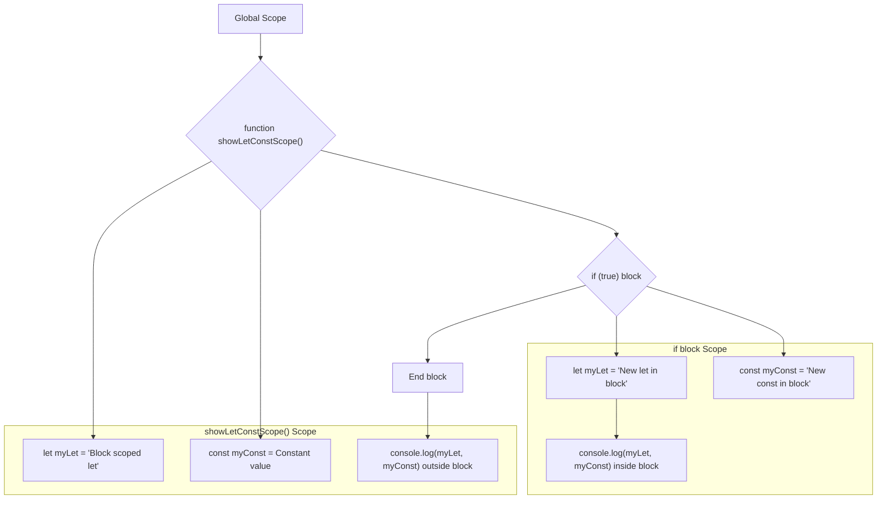
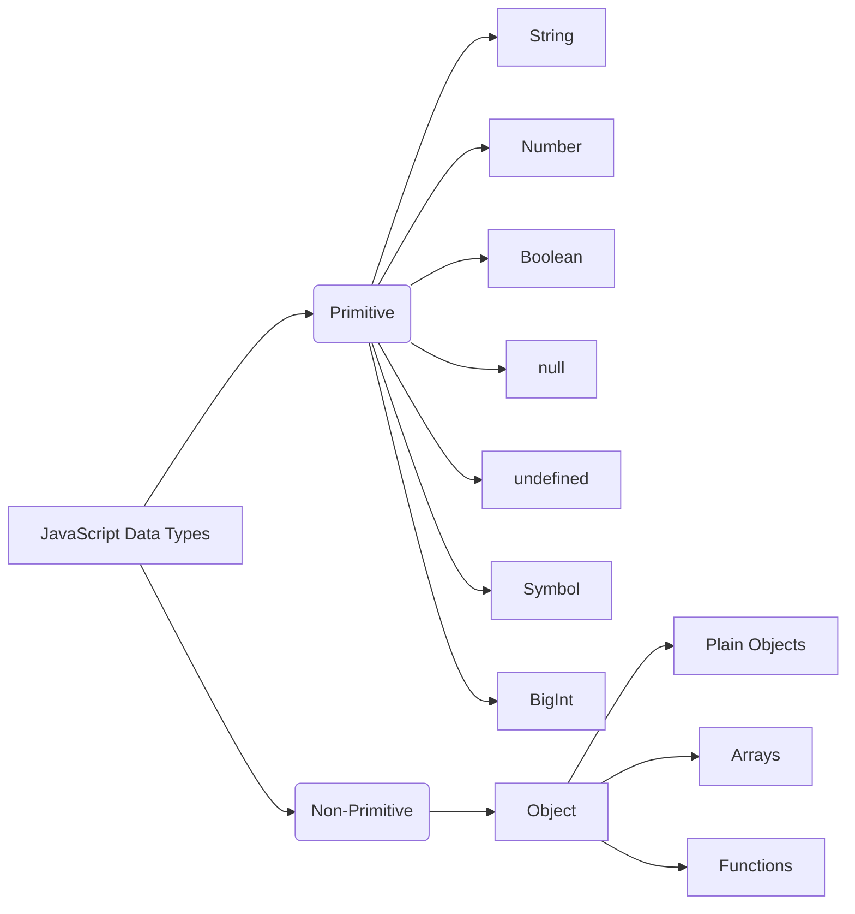
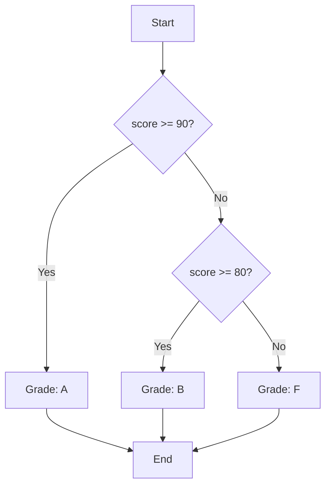
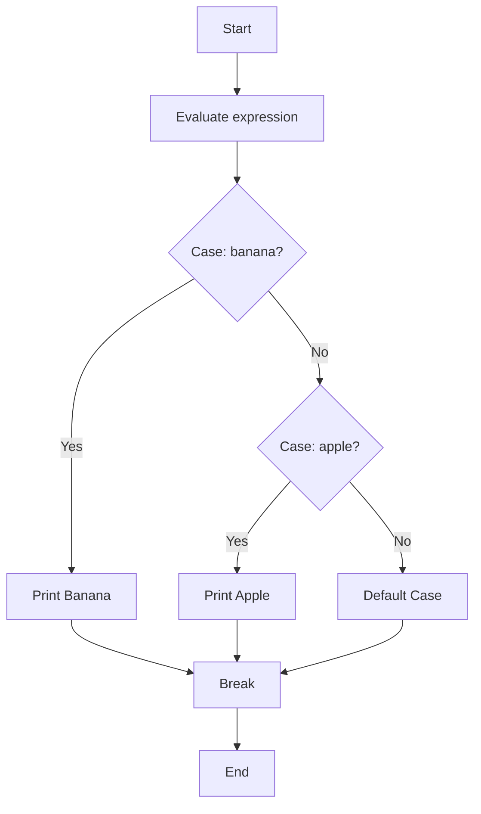
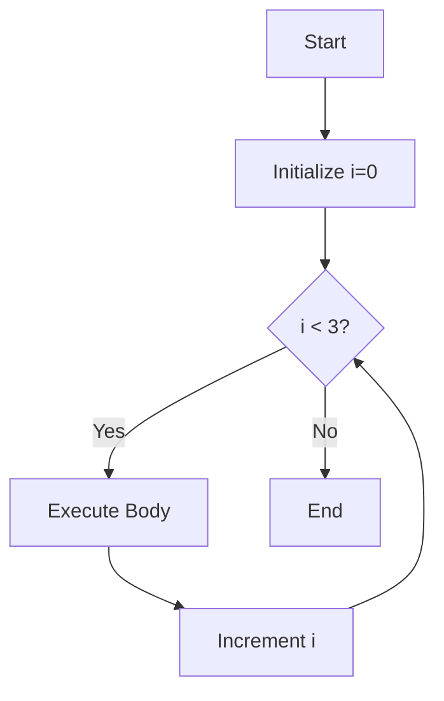
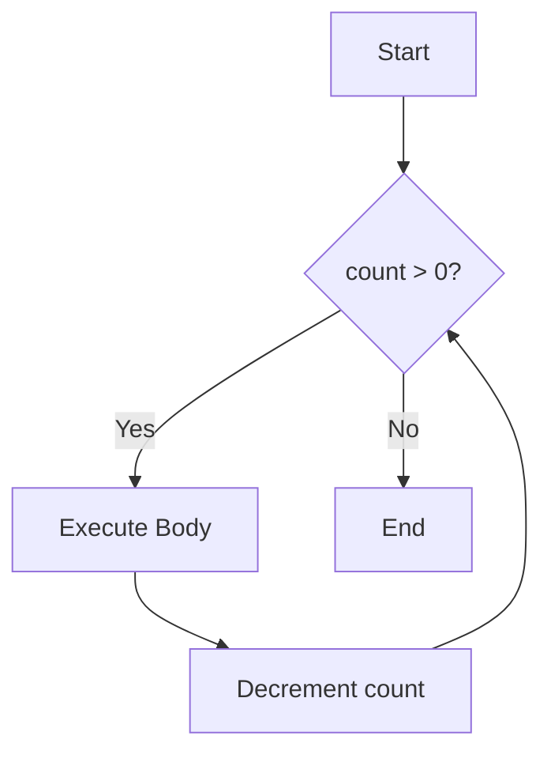
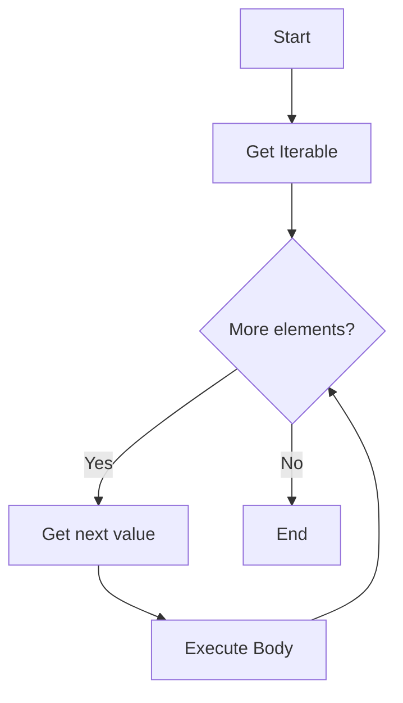
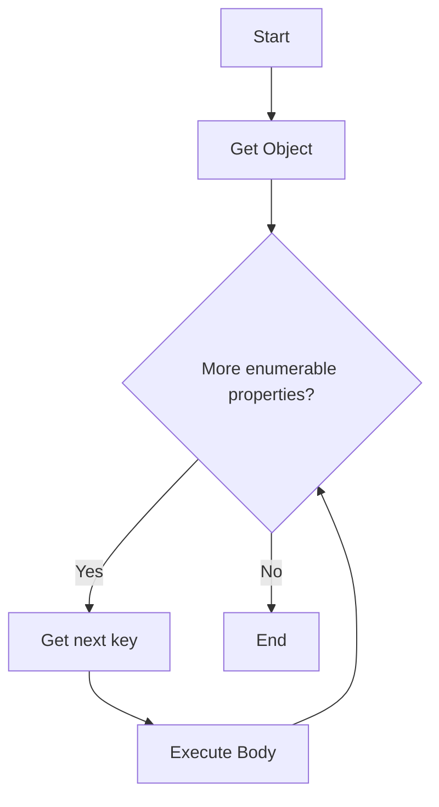
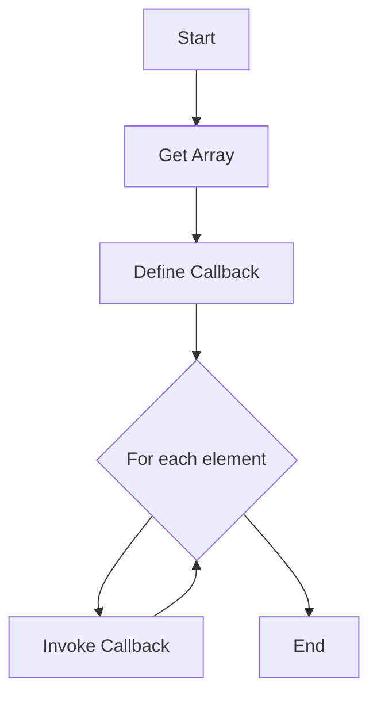

```mermaid
graph TD
    A[Global Scope] --> B["function showVarScope()"]
    B --> C["var myVar = 'I am function-scoped'"]
    C --> D["console.log(myVar) before init → undefined"]
    B --> E["if true block"]
    E --> F["var myVar changed and redeclared"]
    F --> G["console.log(myVar) inside block"]
    E --> H["End of if block"]
    H --> I["console.log(myVar) outside block"]

    subgraph FuncScope
        C
        F
        G
        I
    end

```

# JavaScript Basics: A Visual Guide with Mermaid Diagrams

JavaScript is a versatile language powering the web. Understanding its fundamental concepts is essential for any developer. Below you'll find explanations of key JavaScript features alongside Mermaid diagrams that visually explain the flow and structure.

---

## 1. Variables: `var`, `let`, and `const`

### `var` (Function Scoped, Hoisted)

* Function scoped and hoisted.
* Can be redeclared and updated anywhere in the function.

```javascript
function showVarScope() {
    console.log(myVar); // undefined (hoisted)
    var myVar = "I am function-scoped";

    if (true) {
        var myVar = "Changed and redeclared!";
        console.log(myVar); // "Changed and redeclared!"
    }
    console.log(myVar); // "Changed and redeclared!"
}
showVarScope();
```



---

### `let` and `const` (Block Scoped, Modern)

* Block scoped, cannot be accessed before declaration (Temporal Dead Zone).
* `let` can be reassigned, `const` cannot.

```javascript
function showLetConstScope() {
    let myLet = "Block scoped let";
    const myConst = "Constant value";

    if (true) {
        let myLet = "New let in block";
        const myConst = "New const in block";
        console.log(myLet, myConst); // inside block
    }

    console.log(myLet, myConst); // outside block
}
showLetConstScope();
```



---

## 2. Data Types in JavaScript

* **Primitive:** String, Number, Boolean, null, undefined, Symbol, BigInt.
* **Non-Primitive:** Objects (including Arrays and Functions).

```javascript
let name = "Alice";      // String
let age = 25;            // Number
let isStudent = true;    // Boolean
let nothing = null;      // null
let notAssigned;         // undefined
const id = Symbol("id"); // Symbol
const bigNum = 12345678901234567890n; // BigInt

let person = { name: "Bob", age: 30 }; // Object
let colors = ["Red", "Green"];          // Array
function greet() { console.log("Hi!"); } // Function
```



---

## 3. Operators

* **Arithmetic:** `+`, `-`, `*`, `/`, `%`, `**`
* **Assignment:** `=`, `+=`, `-=`, etc.
* **Comparison:** `==`, `===`, `!=`, `!==`, `<`, `>`
* **Logical:** `&&`, `||`, `!`
* **Ternary:** `condition ? expr1 : expr2`

```javascript
let x = 5;
x += 10; // 15
console.log(x > 10); // true
console.log(x === "15"); // false (strict)
let result = (x > 10) ? "Greater" : "Smaller";
console.log(result); // "Greater"
```


---

## 4. Conditionals

### `if` / `else if` / `else`

```javascript
let score = 85;
if (score >= 90) {
    console.log("Grade: A");
} else if (score >= 80) {
    console.log("Grade: B"); // Runs here
} else {
    console.log("Grade: F");
}
```



---

### `switch`

```javascript
let fruit = "apple";
switch (fruit) {
    case "banana":
        console.log("Banana");
        break;
    case "apple":
        console.log("Apple"); // Runs here
        break;
    default:
        console.log("Unknown fruit");
}
```



---

## 5. Loops

### `for` Loop

```javascript
for (let i = 0; i < 3; i++) {
    console.log(i);
}
```



---

### `while` Loop

```javascript
let count = 3;
while (count > 0) {
    console.log(count);
    count--;
}
```



---

### `do...while` Loop

```javascript
let i = 0;
do {
    console.log(i);
    i++;
} while (i < 0);
```

---

### `for...of` Loop (Iterables)

```javascript
const fruits = ["apple", "banana"];
for (const fruit of fruits) {
    console.log(fruit);
}
```



---

### `for...in` Loop (Object Properties)

```javascript
const car = { make: "Toyota", model: "Camry" };
for (const key in car) {
    console.log(`${key}: ${car[key]}`);
}
```



---

### `forEach` (Array Method)

```javascript
[10, 20, 30].forEach((num, idx) => {
    console.log(`Index ${idx}: ${num}`);
});
```


