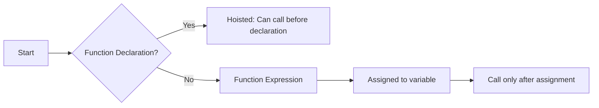
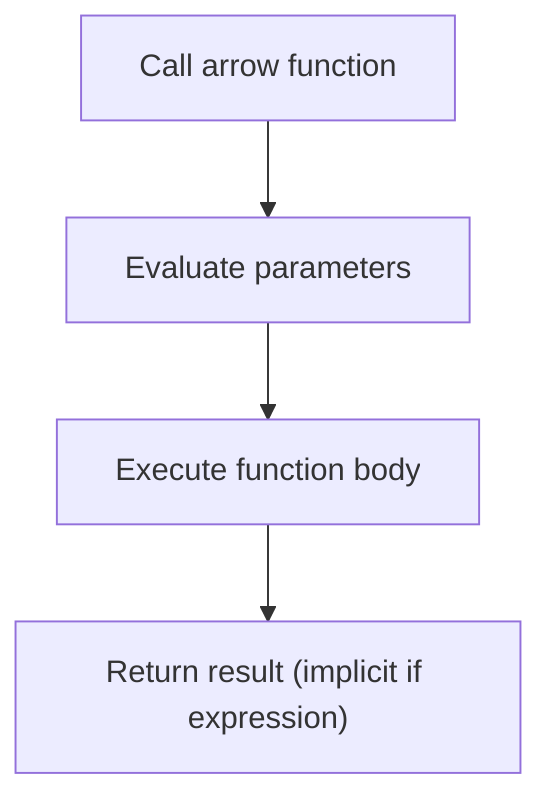
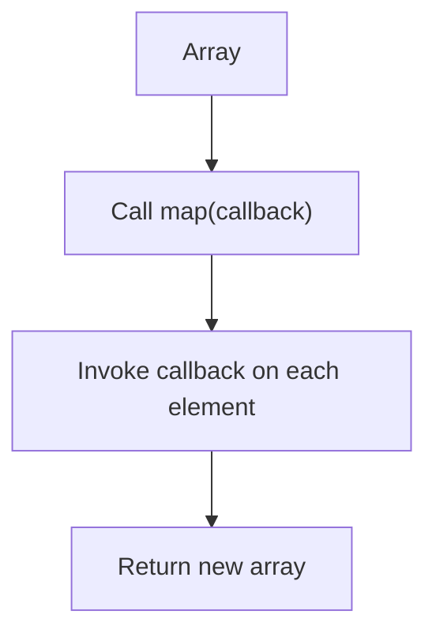
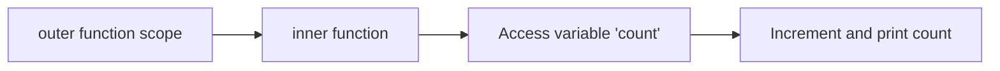
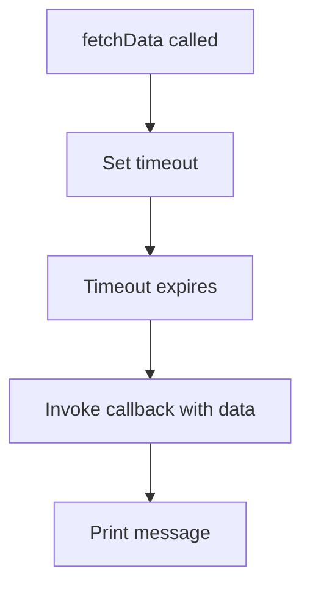
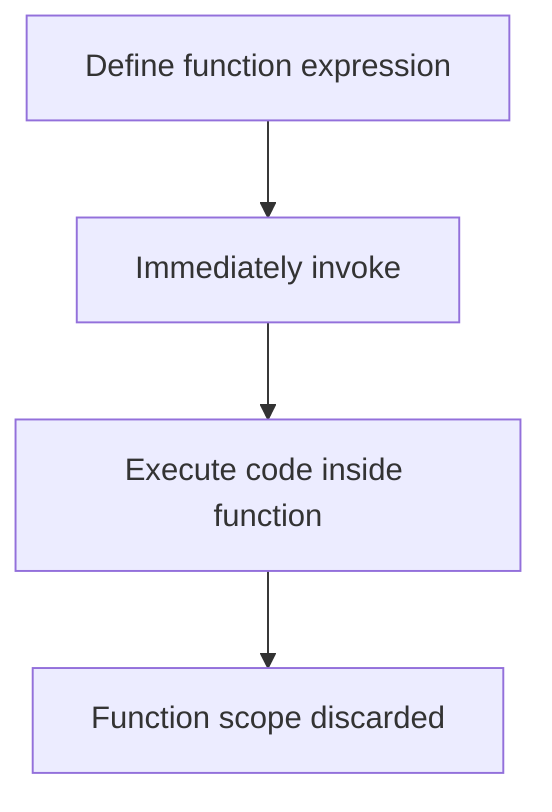

# JavaScript Functions: Complete Guide with Mermaid Diagrams

Functions are the building blocks in JavaScript that let you encapsulate reusable code. This guide covers everything from function declarations to closures with illustrative Mermaid diagrams for better visualization.

---

## 1. Function Declarations vs Function Expressions

### Function Declaration

A function declared with the `function` keyword and a name. It gets hoisted and can be called before its declaration.

```javascript
function greet() {
    console.log("Hello!");
}
greet(); // Works even if called before declaration due to hoisting
```

### Function Expression

A function assigned to a variable. Not hoisted — can only be called after definition.

```javascript
const greet = function() {
    console.log("Hello!");
};
greet(); // Works only after declaration
```

### Diagram: Declarations vs Expressions



---

## 2. Arrow Functions

Arrow functions provide a concise syntax and lexical `this`.

```javascript
const add = (a, b) => a + b;
console.log(add(2, 3)); // 5
```

### Key points:

* No `this`, `arguments`, `super`, or `new.target` binding.
* Cannot be used as constructors.
* Implicit return if body is an expression.

### Diagram: Arrow Function Flow



---

## 3. Higher-Order Functions (HOF)

Functions that take other functions as arguments or return them.

Example: `map`

```javascript
const numbers = [1, 2, 3];
const doubled = numbers.map(num => num * 2);
console.log(doubled); // [2, 4, 6]
```

### Diagram: Higher-Order Function



---

## 4. Closures

A closure is created when a function "remembers" its lexical scope even when executed outside that scope.

```javascript
function outer() {
    let count = 0;
    return function inner() {
        count++;
        console.log(count);
    };
}
const counter = outer();
counter(); // 1
counter(); // 2
```

### Diagram: Closure Concept



---

## 5. Callback Functions

Functions passed as arguments to be executed later.

```javascript
function fetchData(callback) {
    setTimeout(() => {
        callback("Data loaded");
    }, 1000);
}

fetchData(message => console.log(message)); // "Data loaded"
```

### Diagram: Callback Flow



---

## 6. Immediately Invoked Function Expressions (IIFE)

Functions executed immediately after their definition to create a new scope.

```javascript
(function() {
    console.log("IIFE executed");
})();
```

### Diagram: IIFE Execution



---

# Summary Table of JavaScript Function Types

| Function Type                                  | Syntax Example                       | Hoisted | `this` Binding             | Usage Highlights                                            |
| ---------------------------------------------- | ------------------------------------ | ------- | -------------------------- | ----------------------------------------------------------- |
| Function Declaration                           | `function foo() {}`                  | Yes     | Dynamic based on caller    | Traditional, can be called before defined                   |
| Function Expression                            | `const foo = function() {}`          | No      | Dynamic based on caller    | Assigned to variable, more flexible                         |
| Arrow Function                                 | `const foo = () => {}`               | No      | Lexical (`this` of parent) | Concise syntax, no `this` binding                           |
| Higher-Order Function                          | `array.map(callback)`                | Depends | Depends                    | Pass or return functions                                    |
| Closure                                        | `function outer() { return inner; }` | Depends | Depends                    | Functions remembering outer scope variables                 |
| Callback Function                              | `fn(callback)`                       | Depends | Depends                    | Function passed as argument for async or deferred execution |
| Immediately Invoked Function Expression (IIFE) | `(function() { ... })()`             | No      | Dynamic                    | Creates isolated scope immediately                          |

---
