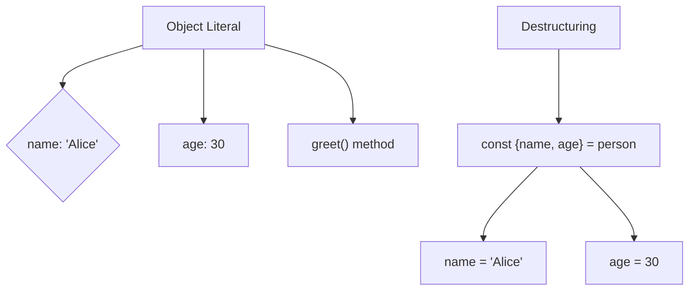
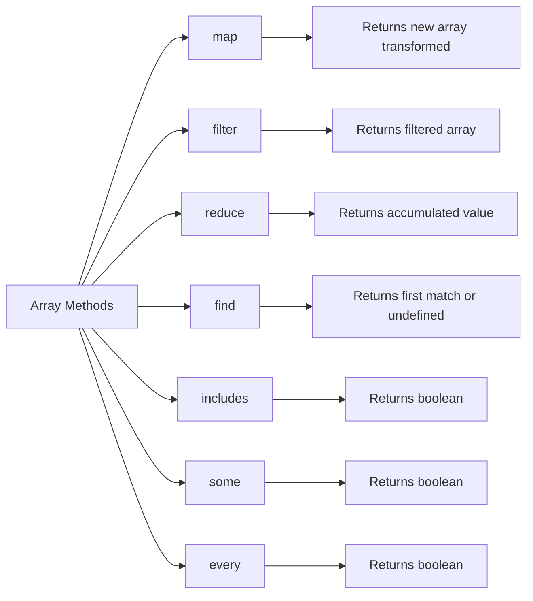
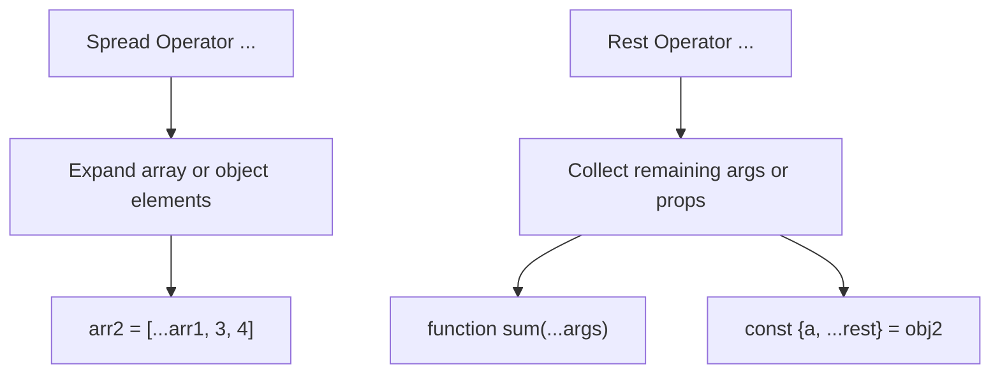
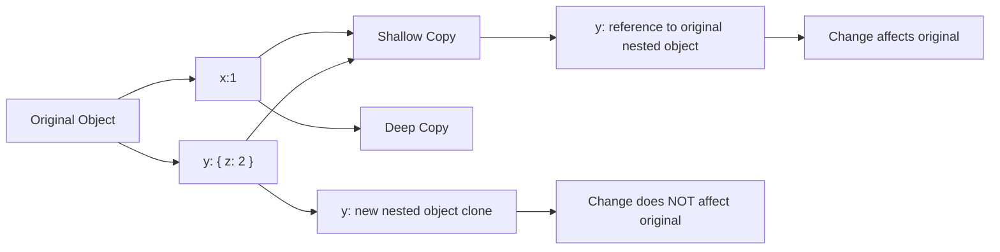

# JavaScript Objects & Arrays: Complete Guide with Diagrams

Objects and arrays are core to JavaScript, enabling structured and flexible data management. This guide covers object literals, destructuring, essential array methods, spread/rest operators, and the differences between shallow and deep copies.

---

## 1. Object Literals & Destructuring

### Object Literals

Create objects using key-value pairs.

```javascript
const person = {
    name: "Alice",
    age: 30,
    greet() {
        console.log("Hello!");
    }
};
```

### Destructuring

Extract properties from objects into variables.

```javascript
const { name, age } = person;
console.log(name, age); // Alice 30
```

### Diagram: Object Literal & Destructuring



---

## 2. Array Methods

### `.map()`

Transforms each element and returns a new array.

```javascript
const nums = [1, 2, 3];
const doubled = nums.map(x => x * 2); // [2, 4, 6]
```

### `.filter()`

Returns elements passing a test.

```javascript
const evens = nums.filter(x => x % 2 === 0); // [2]
```

### `.reduce()`

Accumulates values to a single result.

```javascript
const sum = nums.reduce((acc, curr) => acc + curr, 0); // 6
```

### `.find()`

Finds first element matching condition.

```javascript
const firstEven = nums.find(x => x % 2 === 0); // 2
```

### `.includes()`

Checks if array contains a value.

```javascript
const hasTwo = nums.includes(2); // true
```

### `.some()`

Checks if at least one element passes test.

```javascript
const hasOdd = nums.some(x => x % 2 !== 0); // true
```

### `.every()`

Checks if all elements pass test.

```javascript
const allPositive = nums.every(x => x > 0); // true
```

### Diagram: Array Methods Overview



---

## 3. Spread and Rest Operators

### Spread (`...`)

Expands iterable elements.

```javascript
const arr1 = [1, 2];
const arr2 = [...arr1, 3, 4]; // [1, 2, 3, 4]
const obj1 = { a: 1, b: 2 };
const obj2 = { ...obj1, c: 3 }; // {a:1, b:2, c:3}
```

### Rest (`...`)

Collects multiple elements into an array or object.

```javascript
function sum(...args) {
    return args.reduce((acc, val) => acc + val, 0);
}
sum(1, 2, 3); // 6

const { a, ...rest } = obj2;
console.log(a); // 1
console.log(rest); // {b:2, c:3}
```

### Diagram: Spread vs Rest



---

## 4. Deep vs Shallow Copies

### Shallow Copy

Copies the reference of nested objects — changes reflect in original.

```javascript
const objA = { x: 1, y: { z: 2 } };
const shallowCopy = { ...objA };
shallowCopy.y.z = 3;
console.log(objA.y.z); // 3 (affected)
```

### Deep Copy

Copies all nested objects recursively — independent clone.

```javascript
const deepCopy = JSON.parse(JSON.stringify(objA));
deepCopy.y.z = 4;
console.log(objA.y.z); // 3 (unchanged)
```

### Diagram: Shallow vs Deep Copy



---

# Summary Table: Objects & Arrays

| Concept         | Syntax/Example                                    | Description                              |
| --------------- | ------------------------------------------------- | ---------------------------------------- |
| Object Literal  | `{ name: "Alice", age: 30 }`                      | Key-value pairs to define objects        |
| Destructuring   | `const { name, age } = obj`                       | Extract values into variables            |
| `.map()`        | `arr.map(x => x * 2)`                             | Create new array with transformed values |
| `.filter()`     | `arr.filter(x => x > 2)`                          | Filter elements based on condition       |
| `.reduce()`     | `arr.reduce((acc, val) => acc + val, 0)`          | Reduce array to single value             |
| `.find()`       | `arr.find(x => x === 3)`                          | Find first matching element              |
| `.includes()`   | `arr.includes(3)`                                 | Check if array contains a value          |
| `.some()`       | `arr.some(x => x > 2)`                            | Check if any element passes condition    |
| `.every()`      | `arr.every(x => x > 0)`                           | Check if all elements pass condition     |
| Spread Operator | `[...arr1, 4]` or `{...obj1, c:3}`                | Expand elements of iterable              |
| Rest Operator   | `function(...args)` or `const {a, ...rest} = obj` | Collect remaining elements or properties |
| Shallow Copy    | `{...obj}`                                        | Copies references of nested objects      |
| Deep Copy       | `JSON.parse(JSON.stringify(obj))`                 | Creates full independent clone           |

---
