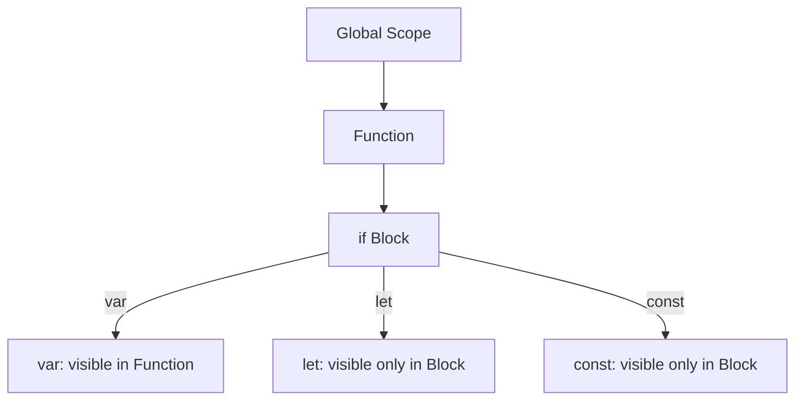
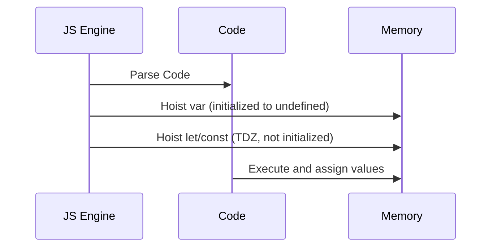
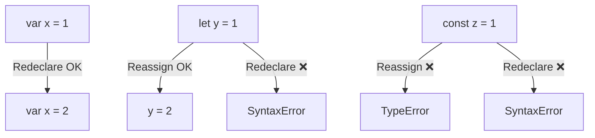
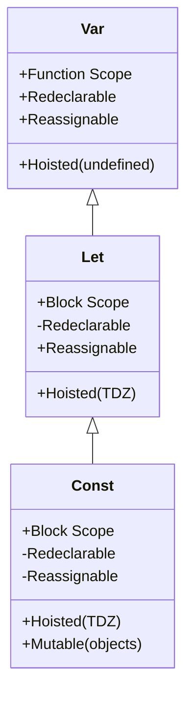
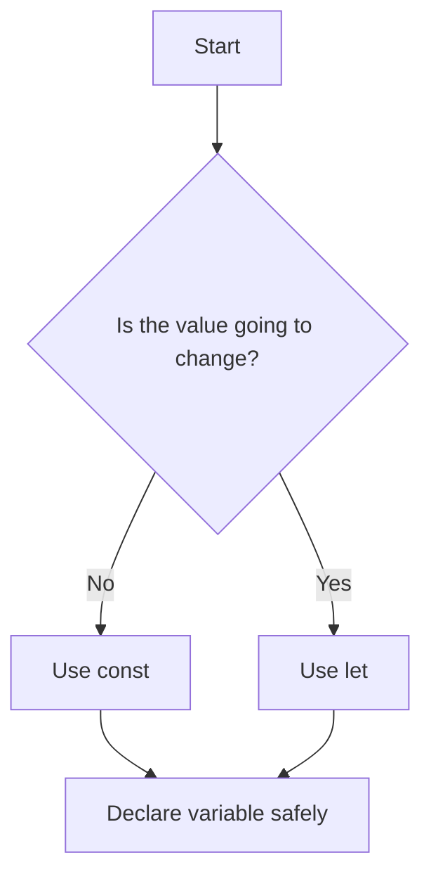

# 📘 JavaScript Variables: `var`, `let`, and `const` (with Mermaid Diagrams)

---

## 🔁 Variable Lifecycle & Scope Flow

### 🔹 Function vs Block Scope



🔍 **Explanation**:

* `var` is **function-scoped**: available inside the entire function.
* `let` & `const` are **block-scoped**: available only within `{}` where declared.

---

## ⏫ Hoisting Visualization



🔍 **Explanation**:

* `var` is **hoisted and initialized** with `undefined`.
* `let` and `const` are **hoisted but not initialized**, which leads to **TDZ errors**.

---

## 📦 TDZ (Temporal Dead Zone)

```mermaid
gantt
    dateFormat  X
    title TDZ Example (let/const)

    section Scope Timeline
    TDZ :a1, 0, 30
    Initialization :a2, 30, 70
```



🔍 **Explanation**:

* Between entering scope and initialization, the variable is in a **TDZ**.
* Accessing it in this zone causes `ReferenceError`.

---

## ♻️ Reassignment & Mutability



🔍 **Explanation**:

* `var` allows redeclaration.
* `let` allows reassignment but not redeclaration.
* `const` allows neither.

---

## 🧪 Closure Bug with `var` in Loops

```mermaid
sequenceDiagram
  participant Loop (i)
  participant Timer
  participant Console

  Loop->>Timer: setTimeout(() => console.log(i))
  Timer-->>Console: Logs 3, 3, 3 (after loop ends)
```

🔍 **Fix** with `let`:

* Each loop iteration gets its **own scope** for `let i`.

---

## 🧾 Summary Table



---

## ✅ Best Practice Flow


