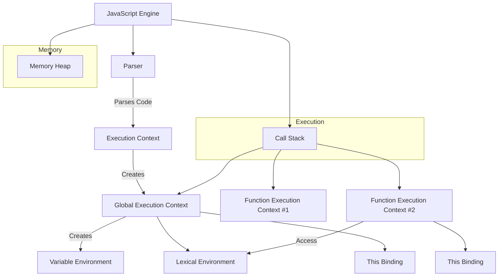

## 🧠 Understanding JavaScript Execution Context: A Visual Guide

When JavaScript runs your code, there's a lot happening under the hood. To write efficient, bug-free code, it's crucial to understand **how the JavaScript engine works**, particularly the **Execution Context** and the **Call Stack**. This blog will break it down with an easy-to-understand Mermaid diagram.

---

### 🔍 What is an Execution Context?

Every time a JavaScript function runs, an **Execution Context (EC)** is created. Think of it as the environment where the function executes. There are **three main types**:

* **Global Execution Context (GEC)** – created by default
* **Function Execution Context (FEC)** – created every time a function is invoked
* **Eval Execution Context** – created when `eval()` is used (rarely)

Each context has:

* **Variable Environment** – contains variable/function declarations
* **Lexical Environment** – defines the scope chain
* **`this` Binding** – determines what `this` refers to

---

### 📦 Visualizing with Mermaid

Here's a Mermaid diagram to visualize the **Execution Context**, **Call Stack**, and **JavaScript Engine flow**:



---

### 📚 Step-by-Step: How Execution Works

1. **Code Parsing**:

   * JS engine starts with parsing using the **Parser**.
   * It converts code into an **Abstract Syntax Tree (AST)**.

2. **Global Execution Context is created**:

   * Memory is allocated in the **Variable Environment**.
   * `this` is bound to the global object (`window` in browsers).
   * The context is **pushed** onto the **Call Stack**.

3. **Function Calls**:

   * Each function creates a **new Function Execution Context**.
   * It’s pushed onto the **Call Stack**.
   * When finished, it’s **popped off**.

4. **Memory Management**:

   * Objects are stored in the **Memory Heap**.
   * The JS engine uses **garbage collection** to free memory.

---

### 🧩 Call Stack: The Execution Tracker

The **Call Stack** is a LIFO (Last In, First Out) stack structure that keeps track of where the engine is in the code.

```js
function first() {
  second();
  console.log("First");
}
function second() {
  console.log("Second");
}
first();
```

**Call Stack Flow**:

1. `first()` is called → `first()` context pushed
2. `second()` is called inside `first()` → `second()` context pushed
3. `console.log("Second")` runs → `second()` context popped
4. Back to `first()` → `console.log("First")` runs → `first()` context popped

---

### 🧠 Why It Matters

Understanding the **Execution Context** and **Call Stack** helps in:

* Debugging stack overflows
* Understanding scope and closures
* Avoiding memory leaks
* Mastering `this` behavior

---

### 🏁 Final Thoughts

The JavaScript Execution Context is the **foundation** of how your code runs. With the help of the **Call Stack**, **Memory Heap**, and the overall **JS Engine architecture**, JavaScript creates an elegant system for code execution.
