# **Complete Guide to the JavaScript `window` Object with Mind Map**

The **JavaScript `window` object** is one of the most essential and widely used objects in web development. It represents the browser window that contains a web page, and it provides various properties, methods, events, and features that are crucial for interacting with the browser environment. This guide explores the key aspects of the `window` object and provides an organized mind map for better understanding.

---

## **Introduction to the `window` Object**

In JavaScript, the `window` object is the global object for the browser. It represents the entire browser window and provides a number of methods and properties to control or retrieve information about the window and its contents. All global JavaScript objects, functions, and variables are automatically part of the `window` object.

The `window` object serves as an interface between JavaScript and the browser, offering access to critical features like navigation, storage, pop-up windows, browser history, and much more.

---

## **Key Features of the `window` Object**

### **1. Properties of the `window` Object**

The `window` object contains several important properties that provide information about the window, document, and the environment:

* **`window`**: Refers to the global `window` object itself.
* **`window.document`**: Provides access to the `document` object, which represents the web page loaded in the window.
* **`window.location`**: Allows you to get or set the URL of the current document.
* **`window.history`**: Provides access to the browser's session history (for navigation purposes).
* **`window.localStorage`**: Allows storing data that persists across browser sessions.
* **`window.sessionStorage`**: Stores data for the duration of the page session.
* **`window.console`**: Provides access to the browser's console for logging and debugging purposes.
* **`window.innerWidth`**: Returns the width of the window's content area.
* **`window.innerHeight`**: Returns the height of the window's content area.

### **2. Methods of the `window` Object**

The `window` object has several methods that control the window or perform actions based on user interaction:

* **`window.alert()`**: Displays a simple alert dialog box.
* **`window.confirm()`**: Displays a confirmation dialog box with "OK" and "Cancel" buttons.
* **`window.prompt()`**: Displays a prompt dialog box that asks for user input.
* **`window.open()`**: Opens a new browser window or tab.
* **`window.close()`**: Closes the current browser window.
* **`window.setTimeout()`**: Executes a function after a specified delay (in milliseconds).
* **`window.setInterval()`**: Repeatedly executes a function at specified intervals.
* **`window.clearTimeout()`**: Cancels a timeout set with `setTimeout()`.
* **`window.clearInterval()`**: Cancels an interval set with `setInterval()`.

### **3. Events of the `window` Object**

The `window` object also allows you to interact with the browser’s events, enabling you to respond to different actions like resizing the window, scrolling, or loading the page.

* **`window.onload`**: Fired when the entire page (including all dependent resources like images and scripts) has finished loading.
* **`window.resize`**: Fired when the browser window is resized.
* **`window.scroll`**: Fired when the user scrolls the page.
* **`window.beforeunload`**: Fired before the window is closed or the user navigates away from the page.

### **4. Other Features of the `window` Object**

The `window` object has other useful properties that allow you to interact with additional browser features:

* **`window.frames`**: Provides access to all the `<iframe>` elements in the window, allowing manipulation of embedded content.
* **`window.screen`**: Provides information about the screen on which the browser window is displayed, such as the screen width and height.
* **`window.navigator`**: Provides information about the browser, such as its version, user agent, and the operating system.

---

## **Mind Map for the JavaScript `window` Object**

Here’s a visual representation of the **JavaScript `window` object** and its key components in the form of a **Mind Map**:

```mermaid
flowchart TD
    A["JavaScript Window Object"]
    A1["Properties"]
    A2["Methods"]
    A3["Events"]
    A4["Other Features"]

    A --> A1
    A --> A2
    A --> A3
    A --> A4

    %% Properties
    A1 --> A1a["window"]
    A1 --> A1b["window.document"]
    A1 --> A1c["window.location"]
    A1 --> A1d["window.history"]
    A1 --> A1e["window.localStorage"]
    A1 --> A1f["window.sessionStorage"]
    A1 --> A1g["window.console"]
    A1 --> A1h["window.innerWidth"]
    A1 --> A1i["window.innerHeight"]

    %% Methods
    A2 --> A2a["window.alert()"]
    A2 --> A2b["window.confirm()"]
    A2 --> A2c["window.prompt()"]
    A2 --> A2d["window.open()"]
    A2 --> A2e["window.close()"]
    A2 --> A2f["window.setTimeout()"]
    A2 --> A2g["window.setInterval()"]
    A2 --> A2h["window.clearTimeout()"]

    %% Events
    A3 --> A3a["window.onload"]
    A3 --> A3b["window.resize"]
    A3 --> A3c["window.scroll"]
    A3 --> A3d["window.beforeunload"]
    A3 --> A3e["window.focus"]
    A3 --> A3f["window.blur"]
    A3 --> A3g["window.unload"]

    %% Other Features
    A4 --> A4a["window.frames"]
    A4 --> A4b["window.screen"]
    A4 --> A4c["window.navigator"]
    A4 --> A4d["window.performance"]

```



---

## **Practical Examples of Using the `window` Object**

### **Example 1: Opening and Closing a Window**

```javascript
// Open a new window
let newWindow = window.open('https://www.example.com', '_blank');

// Close the newly opened window
newWindow.close();
```

### **Example 2: Using `window.setTimeout()`**

```javascript
// Set a timer to display a message after 3 seconds
window.setTimeout(function() {
  alert('This is a delayed message');
}, 3000);
```

### **Example 3: Handling Window Resize Event**

```javascript
window.addEventListener('resize', function() {
  console.log('Window resized. New dimensions: ' + window.innerWidth + 'x' + window.innerHeight);
});
```

### **Example 4: Storing Data with `window.localStorage`**

```javascript
// Store user preferences in localStorage
localStorage.setItem('theme', 'dark');

// Retrieve user preferences
let theme = localStorage.getItem('theme');
console.log('Current theme: ' + theme);
```

---

## **Conclusion**

The **JavaScript `window` object** is a versatile and essential part of the browser’s JavaScript environment. It provides powerful tools for interacting with the browser window, manipulating the document, handling events, and accessing various properties and features like storage, navigation, and the console.

### **Key Takeaways:**

* **Properties**: Access information about the document, screen, and storage.
* **Methods**: Perform actions like opening windows, setting timeouts, and displaying dialogs.
* **Events**: Respond to events like resizing the window or loading the page.
* **Other Features**: Use advanced features like `window.frames` and `window.navigator` for further functionality.

By understanding and effectively utilizing the `window` object, you can create more dynamic and interactive web applications. Whether it's handling user input, controlling the window, or working with storage, the `window` object is at the heart of many web development tasks.
