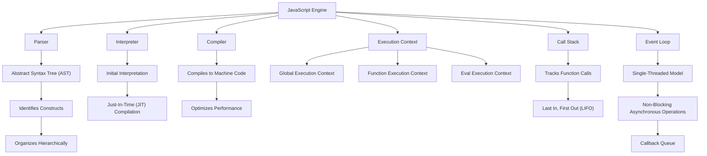

# **Comprehensive Guide to the JavaScript Engine**

The **JavaScript engine** is a critical part of web development. It is responsible for interpreting and executing JavaScript code. Each modern browser has its own JavaScript engine, and it operates by transforming the JavaScript code written by developers into machine code that the CPU can execute.

Understanding how the JavaScript engine works allows developers to optimize their code, improving performance and efficiency. This guide will cover how the JavaScript engine functions, its core components, the life cycle of code execution, and the optimization techniques used to make JavaScript faster.

---

## **1. What is a JavaScript Engine?**

A **JavaScript engine** is a software component that interprets and executes JavaScript code. The engine is responsible for parsing, compiling, and executing JavaScript instructions in the browser or server environment (such as Node.js).

Every browser has a JavaScript engine:

* **Google Chrome** uses **V8**.
* **Firefox** uses **SpiderMonkey**.
* **Safari** uses **JavaScriptCore** (Nitro).
* **Edge** used to use **Chakra**, but now uses V8 (same as Chrome).

The engine's primary job is to run the JavaScript code and provide an execution environment for code.

---

## **2. Key Components of a JavaScript Engine**

JavaScript engines are complex systems with many components working together to execute code efficiently. The key components include:

### **A. Parser**

The **parser** takes the raw JavaScript code as input and converts it into a more structured format: the **Abstract Syntax Tree (AST)**. The AST is a representation of the code's syntax and structure.

* The parser identifies the different constructs in the code (such as variables, functions, loops, etc.) and organizes them hierarchically.

### **B. Interpreter**

Once the JavaScript code is parsed into an AST, it is sent to the **interpreter**, which executes the code. In earlier engines, the code was interpreted line-by-line. However, modern engines use a more efficient method:

* The code is initially interpreted to execute quickly.
* Performance can be improved later through **Just-In-Time (JIT)** compilation.

### **C. Compiler**

A modern JavaScript engine uses a **JIT compiler** to compile JavaScript into machine code while the code is running. This allows the engine to optimize the code for performance during execution.

* **JIT (Just-In-Time) Compilation**: The engine analyzes the code as it runs, and if a part of the code is executed multiple times, it compiles that part into machine code to speed up further execution.

### **D. Execution Context**

When JavaScript code is run, it operates within an **execution context**, which provides the scope, the variables, and the environment where the code runs.

* **Global Execution Context**: Created when the script is first run.
* **Function Execution Context**: Created each time a function is called.
* **Eval Execution Context**: Created when the code is executed via `eval()`.

### **E. Call Stack**

The **call stack** is where the engine keeps track of function calls. When a function is called, it is pushed onto the stack, and once it finishes, it is popped off. This mechanism follows the **Last In, First Out (LIFO)** principle.

* **Stack**: Keeps track of the current point of execution, allowing the engine to return to the correct spot when functions complete.

### **F. Event Loop**

JavaScript operates on a **single-threaded model**, meaning it executes one operation at a time. The **event loop** allows asynchronous operations (such as I/O operations) to be executed in a non-blocking manner.

* When a function is called asynchronously (e.g., using `setTimeout()` or fetching data), the event loop ensures it is placed in a **callback queue** and executed once the stack is empty.

---

## **3. Life Cycle of JavaScript Code Execution**

### **A. Compilation Phase**

1. **Parsing**: The code is parsed by the JavaScript engine into an Abstract Syntax Tree (AST). The AST is used to represent the structure of the code.
2. **Bytecode Generation**: The engine generates intermediate bytecode or machine instructions from the AST.
3. **Code Optimization**: The JIT compiler optimizes frequently used code paths for faster execution.

### **B. Execution Phase**

1. **Execution Context**: A global execution context is created first, and then any function execution contexts are created as functions are called.
2. **Call Stack**: As the functions are called, they are pushed to the call stack. When a function finishes, it is popped off the stack.
3. **Event Loop**: Handles asynchronous callbacks, ensuring that the program remains responsive and non-blocking.

### **C. Garbage Collection**

As the JavaScript engine executes, it also keeps track of memory usage. It uses **garbage collection** to automatically free up memory that is no longer being used. When variables, objects, or functions are no longer referenced, they become eligible for garbage collection.

* **Mark-and-Sweep Algorithm**: Most engines use this algorithm to mark the variables still in use and sweep away the unused ones.

---

## **4. How JavaScript Engines Handle Asynchronous Operations**

JavaScript is a **single-threaded** language, meaning it can only execute one command at a time. However, with asynchronous programming (e.g., with `setTimeout`, `setInterval`, Promises, or async/await), JavaScript can perform non-blocking operations.

### **A. Event Loop**

* The event loop enables JavaScript to handle asynchronous operations by allowing tasks to be placed in the **callback queue** while the main stack is processing other tasks.
* Once the call stack is empty, the event loop dequeues the next task in the callback queue and runs it.

### **B. Example:**

```javascript
console.log("Start");

setTimeout(function() {
  console.log("Middle");
}, 1000);

console.log("End");
```

**Output**:

```
Start
End
Middle
```

* Even though `setTimeout()` is called before `console.log("End")`, it is placed in the callback queue, and the event loop waits for the call stack to be cleared before executing it.

---

## **5. Optimization Techniques in JavaScript Engines**

JavaScript engines use various optimization techniques to improve performance and reduce execution time:

### **A. Inlining**

Frequently called functions or small blocks of code are **inlined**, meaning the function body is inserted directly into the calling code to avoid function call overhead.

### **B. Code Caching**

The engine stores **compiled code** in memory after it has been executed for the first time. If the code is encountered again, the engine can directly use the precompiled version, improving performance.

### **C. Dead Code Elimination**

The engine identifies and removes **dead code** (code that will never be executed) during the compilation process.

### **D. Optimizing Loops**

JavaScript engines are optimized for common patterns, especially loops. The engine detects **hot loops** (loops that run many times) and tries to optimize them by unrolling loops or applying other techniques.

---

## **6. Popular JavaScript Engines**

### **A. V8 Engine (Google Chrome and Node.js)**

* **V8** is a **JIT compiler** that compiles JavaScript directly into machine code.
* It is known for its **high performance** and the use of **inline caching** and **optimization** strategies.

### **B. SpiderMonkey (Firefox)**

* **SpiderMonkey** is the first JavaScript engine, developed by **Mozilla** for Firefox.
* It supports **JIT compilation**, garbage collection, and has extensive debugging capabilities.

### **C. JavaScriptCore (Safari)**

* **JavaScriptCore** (also called **Nitro**) is used by **Safari** and is known for its **JIT** and **garbage collection** capabilities.

### **D. Chakra (Microsoft Edge)**

* **Chakra** was the JavaScript engine used by the old **Microsoft Edge** browser.
* It also supported **JIT compilation** and optimized asynchronous code execution.

---

## **7. JavaScript Engine Internals**

Each JavaScript engine has its own internal mechanisms for handling the various stages of code execution. For example:

* **V8**: Uses **Ignition** (interpreter) and **Turbofan** (compiler) for performance optimization.
* **SpiderMonkey**: Implements **IonMonkey** (JIT compiler) and **Baseline Compiler** for faster execution.
* **JavaScriptCore**: Uses a multi-tiered **JIT compilation** system that optimizes frequently executed code paths.

---



## **8. Conclusion**

The **JavaScript engine** is an essential component that converts JavaScript code into executable machine code. Understanding how it works allows developers to write better, more efficient JavaScript code, optimize performance, and troubleshoot issues more effectively.

### **Key Takeaways**:

* **Parsing, Compilation, and Execution**: The engine converts JavaScript code into machine code through a series of steps including parsing, compilation, and execution.
* **JIT Compilation**: Modern engines use JIT compilation to optimize code at runtime, making JavaScript faster.
* **Event Loop**: The event loop manages asynchronous tasks, allowing JavaScript to be non-blocking.
* **Memory Management**: JavaScript engines automatically manage memory through garbage collection.

By understanding these fundamentals, developers can optimize their code, enhance performance, and build better applications.
