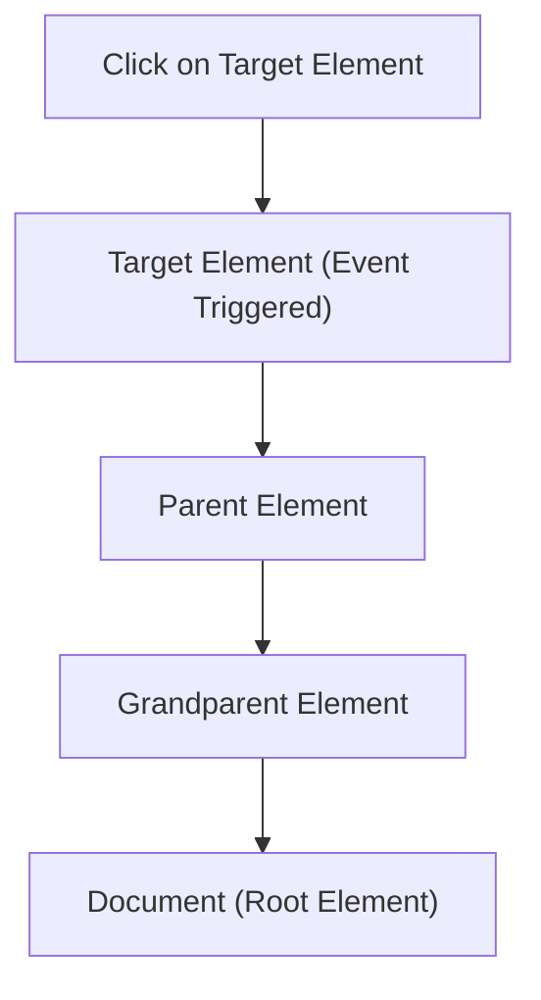
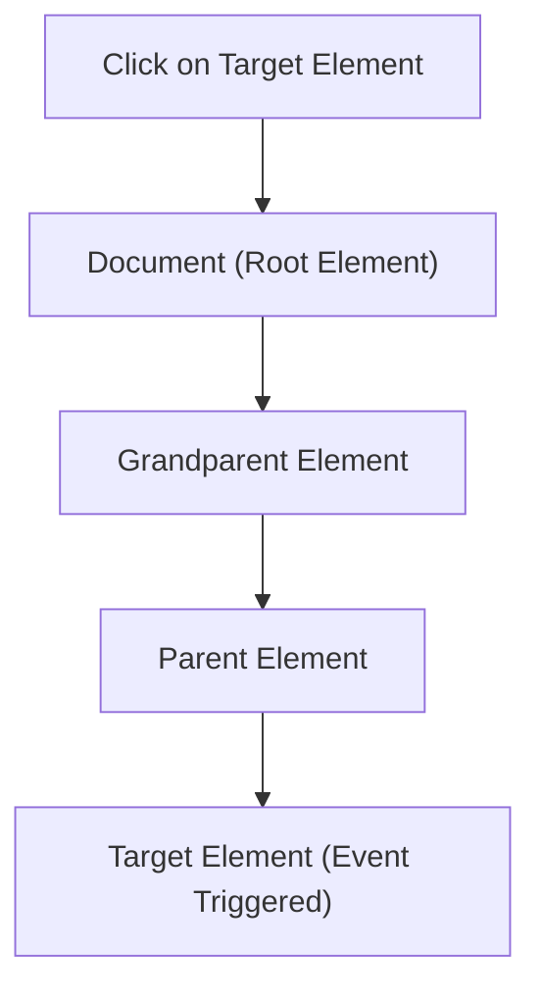

# **Event Bubbling vs. Event Capturing in JavaScript**

## **Introduction**

In JavaScript, **events** are triggered when a user interacts with an element on a webpage, such as clicking a button or hovering over an image. When an event occurs, it doesn't just affect the target element where the interaction happened — it propagates throughout the DOM tree, potentially affecting parent elements as well.

There are two main ways an event propagates through the DOM: **Event Bubbling** and **Event Capturing**. These are two phases of event propagation in JavaScript that determine how the event flows from the target element to its ancestors (or vice versa).

---

## **Event Bubbling**

**Event Bubbling** is the default behavior in most modern browsers. In this model, the event starts from the **target element** (where the event occurred) and then "bubbles up" to its **ancestors** (parent, grandparent, etc.), eventually reaching the root element (`document`).

### **How it works:**

1. The event is triggered on the target element (the innermost element).
2. It then bubbles up through each ancestor element in the DOM tree.
3. The event can be captured by the parent elements at each stage.

### **Example of Event Bubbling:**

```html
<div id="parent">
    <button id="child">Click me!</button>
</div>

<script>
  document.getElementById('parent').addEventListener('click', () => {
    alert('Parent clicked!');
  });

  document.getElementById('child').addEventListener('click', () => {
    alert('Child clicked!');
  });
</script>
```

In this example:

* Clicking the **child button** will first trigger the click event on the **child** element, and then it will bubble up to the **parent** element.
* You will see two alerts: first "Child clicked!", then "Parent clicked!".

---

## **Event Capturing (Trickling)**

**Event Capturing** (also known as **Event Trickling**) is the opposite of bubbling. In this model, the event starts from the **root element** (or a specified ancestor) and "trickles down" through the DOM tree to the target element (where the event occurred).

### **How it works:**

1. The event is first captured by the **root element**.
2. It then trickles down to each ancestor element until it reaches the target element.
3. The event can be captured by the parent elements at each stage, starting from the root.

### **Example of Event Capturing:**

```html
<div id="parent">
    <button id="child">Click me!</button>
</div>

<script>
  document.getElementById('parent').addEventListener('click', () => {
    alert('Parent clicked!');
  }, true); // true indicates capturing phase

  document.getElementById('child').addEventListener('click', () => {
    alert('Child clicked!');
  });
</script>
```

In this example:

* The **parent** element will first capture the event in the **capturing phase** because we passed `true` as the third argument to `addEventListener()`.
* You will see two alerts: first "Parent clicked!", then "Child clicked!" in that order.

---

## **Event Propagation Phases:**

1. **Capturing Phase (Trickling)**: The event starts at the root and trickles down to the target.
2. **Target Phase**: The event reaches the target element where it occurred.
3. **Bubbling Phase**: The event bubbles back up to the root element.

---

## **Comparison of Event Bubbling vs. Event Capturing**

| Feature                | Event Bubbling                                                  | Event Capturing                                                          |
| ---------------------- | --------------------------------------------------------------- | ------------------------------------------------------------------------ |
| **Direction of Event** | From the target element upwards to the root                     | From the root element down to the target                                 |
| **Default Behavior**   | Yes, it’s the default behavior in most browsers                 | No, you need to specify `true` in `addEventListener`                     |
| **Event Listeners**    | Added to child elements (bubbling up)                           | Added to parent elements (capturing down)                                |
| **Use Case**           | Typically used for handling user actions on elements in the DOM | Used for capturing events at the root level before they reach the target |

---

## **Mermaid Diagrams: Event Propagation Flow**

### **Event Bubbling Flow**



In this **Event Bubbling** diagram:

* The event starts at the **Target Element** and bubbles up through the **Parent Element**, **Grandparent Element**, and eventually reaches the **Document (Root Element)**.

---

### **Event Capturing Flow**



In this **Event Capturing** diagram:

* The event starts at the **Document (Root Element)** and trickles down through the **Grandparent Element**, **Parent Element**, and finally reaches the **Target Element**.

---

## **Controlling Event Propagation**

You can stop event propagation using the `stopPropagation()` method, which prevents the event from bubbling up or trickling down.

```javascript
document.getElementById('child').addEventListener('click', (e) => {
    alert('Child clicked!');
    e.stopPropagation(); // Stops the event from bubbling up
});
```

By calling `stopPropagation()`, the event will be stopped from propagating further, and the parent event listener won’t be triggered.

---

## **Conclusion**

* **Event Bubbling** is the default behavior in JavaScript, where the event starts at the target element and bubbles up to the root.
* **Event Capturing** is the reverse, where the event starts at the root and trickles down to the target element.
* Both phases allow you to add event listeners at different levels of the DOM to control how events are handled.
* You can control the flow of events using `stopPropagation()` to prevent unwanted behavior.

Both **Event Bubbling** and **Event Capturing** have their use cases, and understanding when and how to use each can be critical for building efficient and well-structured applications in JavaScript.
