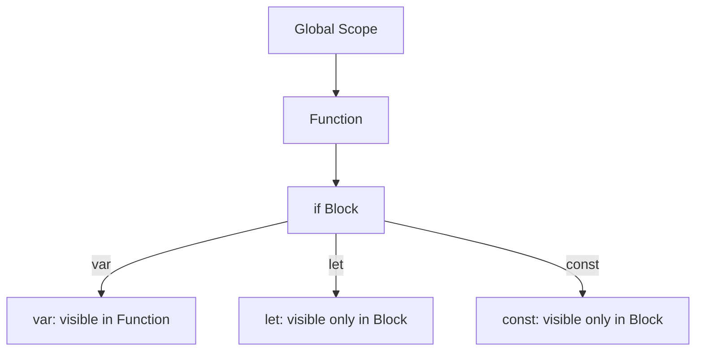
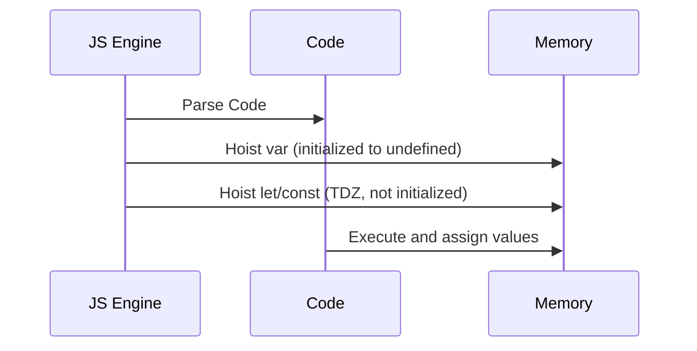
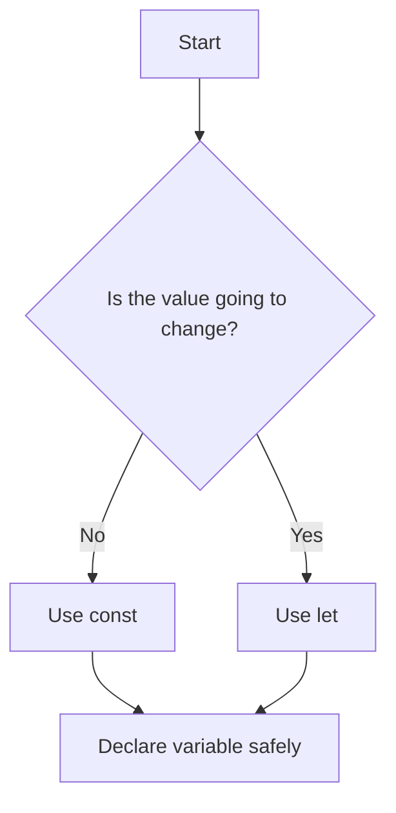

# 📘 JavaScript Variables: `var`, `let`, and `const` (with Mermaid Diagrams)

---

## 🔁 Variable Lifecycle & Scope Flow

### 🔹 Function vs Block Scope

🔍 **Explanation**:

* `var` is **function-scoped**: available inside the entire function.
* `let` & `const` are **block-scoped**: available only within `{}` where declared.

---

## ⏫ Hoisting Visualization

🔍 **Explanation**:

* `var` is **hoisted and initialized** with `undefined`.
* `let` and `const` are **hoisted but not initialized**, which leads to **TDZ errors**.

---

## 📦 TDZ (Temporal Dead Zone)

```mermaid
gantt
    dateFormat  X
    title TDZ Example (let/const)

    section Scope Timeline
    TDZ :a1, 0, 30
    Initialization :a2, 30, 70
```

🔍 **Explanation**:

* Between entering scope and initialization, the variable is in a **TDZ**.
* Accessing it in this zone causes `ReferenceError`.

---

## ♻️ Reassignment & Mutability

```mermaid
graph TD
  A[var x = 1] -->|Redeclare OK| A2[var x = 2]
  B[let y = 1] -->|Reassign OK| B2[y = 2]
  B -->|Redeclare ❌| B3[SyntaxError]
  C[const z = 1] -->|Reassign ❌| C2[TypeError]
  C -->|Redeclare ❌| C3[SyntaxError]
```

🔍 **Explanation**:

* `var` allows redeclaration.
* `let` allows reassignment but not redeclaration.
* `const` allows neither.

---

## ✅ Best Practice Flow

