# **JavaScript `document` Object**

The **`document` object** is a part of the **DOM (Document Object Model)** in JavaScript. It represents the entire HTML document that is loaded into the browser. The `document` object serves as an interface to interact with the content of the web page. It provides methods to access, manipulate, and modify elements, attributes, styles, events, and more.

This document will cover the various methods and properties of the `document` object, explaining how to use them to interact with the HTML structure of a webpage.

---

## **1. Understanding the `document` Object**

The `document` object represents the content of the current webpage and provides a variety of methods for selecting elements, modifying the DOM, handling events, and retrieving information about the page.

The `document` object is part of the **global object** in the browser, meaning it is automatically available in the JavaScript environment and does not need to be imported.

### **Key Features of the `document` Object**

* **Accessing and manipulating elements**: The `document` object allows you to select HTML elements and change their content, styles, or attributes.
* **Event handling**: The `document` object can attach event listeners to elements.
* **DOM Manipulation**: You can add, remove, or modify elements and structure within the DOM.
* **Window and document information**: Access properties like the page's URL, title, and cookies.

---

## **2. Common Methods and Properties of the `document` Object**

### **a. Selecting Elements**

There are several methods available to select DOM elements based on different criteria. These are the most common ones:

1. **`getElementById(id)`**: Selects an element by its `id` attribute.

   ```javascript
   const element = document.getElementById('myElement');
   ```

2. **`getElementsByClassName(className)`**: Selects all elements that have the specified class name. Returns a live HTMLCollection.

   ```javascript
   const elements = document.getElementsByClassName('myClass');
   ```

3. **`getElementsByTagName(tagName)`**: Selects all elements with the specified tag name. Returns a live HTMLCollection.

   ```javascript
   const paragraphs = document.getElementsByTagName('p');
   ```

4. **`querySelector(selector)`**: Selects the first element that matches the provided CSS selector (e.g., `.myClass`, `#myElement`).

   ```javascript
   const element = document.querySelector('.myClass');
   ```

5. **`querySelectorAll(selector)`**: Selects all elements that match the provided CSS selector. Returns a static NodeList.

   ```javascript
   const allDivs = document.querySelectorAll('div.myClass');
   ```

---

### **b. Manipulating Elements**

Once an element is selected, you can manipulate its content, attributes, and style.

1. **Changing Text Content**:

   ```javascript
   const element = document.getElementById('myElement');
   element.textContent = 'New content here!';
   ```

2. **Changing HTML Content**:

   ```javascript
   const element = document.getElementById('myElement');
   element.innerHTML = '<p>This is a new paragraph</p>';
   ```

3. **Changing Inline Styles**:

   ```javascript
   const element = document.getElementById('myElement');
   element.style.color = 'red';
   element.style.fontSize = '20px';
   ```

4. **Setting or Getting Attributes**:

   * To get an attribute:

     ```javascript
     const element = document.getElementById('myElement');
     const src = element.getAttribute('src');
     ```
   * To set an attribute:

     ```javascript
     const element = document.getElementById('myElement');
     element.setAttribute('src', 'new-image.jpg');
     ```

5. **Adding or Removing Classes**:

   * Adding a class:

     ```javascript
     const element = document.getElementById('myElement');
     element.classList.add('newClass');
     ```
   * Removing a class:

     ```javascript
     element.classList.remove('oldClass');
     ```

---

### **c. Creating and Adding New Elements**

You can dynamically create new elements and append them to the DOM.

1. **Creating a new element**:

   ```javascript
   const newElement = document.createElement('div');
   newElement.textContent = 'This is a new element';
   ```

2. **Appending a new element to the DOM**:

   ```javascript
   const parentElement = document.getElementById('parent');
   parentElement.appendChild(newElement);
   ```

3. **Inserting a new element before an existing element**:

   ```javascript
   const newElement = document.createElement('div');
   const referenceElement = document.getElementById('referenceElement');
   referenceElement.parentNode.insertBefore(newElement, referenceElement);
   ```

---

### **d. Removing Elements**

To remove an element from the DOM:

```javascript
const element = document.getElementById('myElement');
element.remove(); // Removes the element from the DOM
```

---

### **e. Manipulating the `document` Object**

You can also manipulate the document itself, including the page title, body, cookies, and other metadata.

1. **Modifying the `title` of the Document**:

   ```javascript
   document.title = 'New Page Title';
   ```

2. **Accessing or Modifying the `body` of the Document**:

   ```javascript
   document.body.style.backgroundColor = 'lightblue';
   ```

3. **Accessing or Modifying Cookies**:

   ```javascript
   document.cookie = 'user=John; expires=Fri, 31 Dec 2025 23:59:59 GMT';
   ```

4. **Accessing the `documentElement` (root element)**:

   ```javascript
   const rootElement = document.documentElement; // Represents <html>
   ```

5. **Accessing the `referrer`**:

   ```javascript
   console.log(document.referrer); // Returns the URL of the previous document
   ```

---

### **f. Event Handling with `document`**

The `document` object is commonly used to handle events such as clicks, key presses, or form submissions.

1. **Adding an Event Listener**:

   ```javascript
   document.getElementById('myButton').addEventListener('click', function() {
     alert('Button clicked!');
   });
   ```

2. **Removing an Event Listener**:
   If you want to remove an event listener:

   ```javascript
   const handleClick = () => {
     console.log('Button clicked!');
   };
   const button = document.getElementById('myButton');
   button.addEventListener('click', handleClick);
   button.removeEventListener('click', handleClick);
   ```

3. **Event Delegation**:
   You can attach an event listener to a parent element and listen for events on child elements:

   ```javascript
   document.getElementById('parent').addEventListener('click', function(event) {
     if (event.target && event.target.matches('button.className')) {
       console.log('Button clicked');
     }
   });
   ```

---

## **3. Working with Forms**

You can easily access and modify form inputs using the `document` object.

1. **Accessing Form Inputs**:

   ```javascript
   const form = document.forms['myForm'];
   const inputValue = form['myInput'].value;
   form['myInput'].value = 'New Value'; // Set the value of the input
   ```

2. **Submitting a Form Programmatically**:

   ```javascript
   document.forms['myForm'].submit();
   ```

---

## **4. Browser Window and Document Information**

You can use the `document` object to gather information about the current document and the browser window.

1. **Getting the Current URL**:

   ```javascript
   console.log(document.URL); // Returns the current URL of the page
   ```

2. **Getting the Document’s Referrer**:

   ```javascript
   console.log(document.referrer); // Returns the referrer URL
   ```

3. **Getting the Cookies Associated with the Document**:

   ```javascript
   console.log(document.cookie); // Returns all cookies as a string
   ```

4. **Controlling Scrolling**:
   You can programmatically scroll the page:

   ```javascript
   document.documentElement.scrollTop = 100; // Scroll to a specific position
   ```

---

## **5. Document Structure and Traversing the DOM**

You can traverse and manipulate the DOM tree to move between nodes.

1. **Accessing Parent and Child Nodes**:

   ```javascript
   const parent = document.getElementById('parent');
   const firstChild = parent.firstElementChild; // Access the first child element
   const lastChild = parent.lastElementChild; // Access the last child element
   ```

2. **Accessing Sibling Nodes**:

   ```javascript
   const element = document.getElementById('myElement');
   const nextSibling = element.nextElementSibling; // Next sibling
   const previousSibling = element.previousElementSibling; // Previous sibling
   ```

---



```mermaid
flowchart TD
    A["document Object"] --> B["Selecting Elements"]
    A --> C["Manipulating Elements"]
    A --> D["Event Handling"]
    A --> E["Working with Forms"]
    A --> F["Document Information"]
    
    B --> B1["getElementById"]
    B --> B2["getElementsByClassName"]
    B --> B3["getElementsByTagName"]
    B --> B4["querySelector"]
    B --> B5["querySelectorAll"]
    
    C --> C1["Change Text Content"]
    C --> C2["Change HTML Content"]
    C --> C3["Change Inline Styles"]
    C --> C4["Set/Get Attributes"]
    C --> C5["Add/Remove Classes"]
    
    D --> D1["Add Event Listener"]
    D --> D2["Remove Event Listener"]
    D --> D3["Event Delegation"]
    
    E --> E1["Access Form Inputs"]
    E --> E2["Submit Form Programmatically"]
    
    F --> F1["Get Current URL"]
    F --> F2["Get Referrer"]
    F --> F3["Get Cookies"]
    F --> F4["Control Scrolling"]
    
    %% Styling
    style A fill:#f9f,stroke:#333,stroke-width:2px
    style B fill:#ccf,stroke:#333,stroke-width:2px
    style C fill:#cfc,stroke:#333,stroke-width:2px
    style D fill:#ffcc00,stroke:#333,stroke-width:2px
    style E fill:#ff6666,stroke:#333,stroke-width:2px
    style F fill:#66ccff,stroke:#333,stroke-width:2px
```

## **Conclusion**

The **`document` object** is a crucial part of JavaScript, enabling developers to interact with the content of a web page, modify its structure, and handle events. Whether you are selecting, modifying, or creating elements, working with the `document` object gives you complete control over the webpage’s DOM. Understanding the `document` object and how to manipulate the DOM is fundamental for creating dynamic and interactive web applications.

### **Key Points:**

* **Selecting and manipulating elements**: Use methods like `getElementById`, `querySelector`, and `createElement` to work with DOM elements.
* **Event handling**: Use `addEventListener` to handle events like clicks, key presses, and more.
* **Creating dynamic content**: Add, remove, or modify elements programmatically.
* **Working with forms**: Access and modify form data, and trigger form submissions.
* **Document properties**: Modify the title, cookies, and retrieve information about the current document.

By mastering the `document` object, you can build interactive and dynamic web applications that respond to user input and update in real-time.
