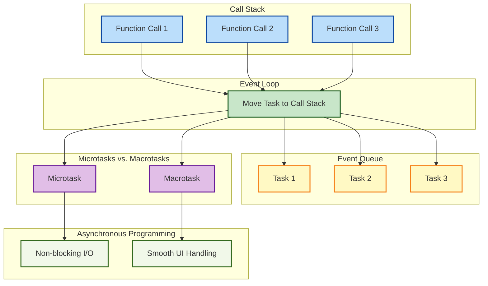

# **Understanding the Event Loop in JavaScript: A Comprehensive Guide**

JavaScript is a **single-threaded** language, meaning it can only execute one task at a time. But how does JavaScript handle tasks like waiting for a network request or responding to user input without freezing up? The answer lies in the **Event Loop**.

In this blog, we’ll take an in-depth look at the **JavaScript Event Loop**, explain its role in handling asynchronous operations, and explore how it allows JavaScript to perform non-blocking I/O operations despite its single-threaded nature.

---

## **1. What is the Event Loop?**

The **Event Loop** is a mechanism in JavaScript that allows asynchronous tasks (such as fetching data from a server or handling user interactions) to be executed without blocking the main thread. It allows JavaScript to perform tasks concurrently in a non-blocking way, even though the language runs in a single thread.

### **Key Points:**

* The **JavaScript runtime** has a **single thread** for executing code.
* **Asynchronous operations** like fetching data, timers, and events are managed by the event loop.
* The event loop helps JavaScript execute code **without blocking the main thread**.

---

## **2. The Call Stack**

Before diving into the Event Loop, it's important to understand how JavaScript handles function calls. The **call stack** is where all the **function calls** are stored as they are executed.

### **How it works:**

* When a function is invoked, it is pushed onto the call stack.
* The JavaScript engine executes it and once the function finishes, it is popped off the stack.
* If the call stack is busy, JavaScript can’t process other tasks until the stack is empty.

### **Example:**

```javascript
function one() {
  console.log('One');
}

function two() {
  console.log('Two');
  one();
}

two();
```

**Output:**

```
Two
One
```

In this case, `two()` is pushed to the stack first, then `one()` is pushed when called inside `two()`. After `one()` finishes, it is removed from the stack, and then `two()` finishes and is removed.

---

## **3. The Event Queue (or Callback Queue)**

JavaScript uses the **Event Queue** (also known as the **Callback Queue**) to handle asynchronous tasks. The Event Queue stores tasks that are ready to be executed but only after the **call stack** is empty.

When asynchronous tasks (like setTimeout or a network request) are completed, the associated **callback function** is added to the event queue. These functions wait their turn to be pushed to the call stack once the stack is empty.

### **Example:**

```javascript
console.log('Start');

setTimeout(function() {
  console.log('Inside setTimeout');
}, 0);

console.log('End');
```

**Output:**

```
Start
End
Inside setTimeout
```

In this example, even though the `setTimeout` is set to `0` milliseconds, it doesn’t run immediately. Instead, the callback function is placed in the event queue and will only be executed after the call stack is cleared, i.e., after `'End'` is logged.

---

## **4. The Event Loop in Action**

Now that we understand the call stack and event queue, let’s look at how the **Event Loop** manages them.

### **How the Event Loop works**:

1. The **call stack** executes the synchronous code first.
2. Once the synchronous code is finished, the **Event Loop** checks the **event queue**.
3. If there are any tasks in the event queue, the event loop pushes the task (callback) to the call stack for execution.
4. This continues indefinitely until there are no more tasks left in the event queue.

The event loop continually checks if the call stack is empty and then moves tasks from the event queue to the stack for execution.

---

## **5. The Event Loop Example with Delays**

Let's break down an example that shows how the event loop manages delays and async tasks:

### **Code Example:**

```javascript
console.log('Start');

setTimeout(function() {
  console.log('First setTimeout');
}, 2000);

setTimeout(function() {
  console.log('Second setTimeout');
}, 0);

console.log('End');
```

**Output:**

```
Start
End
Second setTimeout
First setTimeout
```

### **Explanation:**

1. `'Start'` is logged to the console immediately as it is synchronous.
2. The first `setTimeout` with a delay of 2000 milliseconds is pushed to the event queue.
3. The second `setTimeout` with a delay of 0 milliseconds is also pushed to the event queue, but it still doesn’t run until the call stack is empty.
4. `'End'` is logged next, and once the call stack is empty, the event loop checks the event queue.
5. The second `setTimeout` (with 0 delay) is executed first because it was added to the queue earlier.
6. Finally, the first `setTimeout` (with 2000 ms delay) is executed.

---

## **6. Microtasks and Macrotasks**

In addition to the **event queue**, there are **two types of queues** that the event loop manages: **macrotasks** and **microtasks**.

### **Macrotasks**:

* Regular tasks like `setTimeout`, `setInterval`, and event handlers are placed in the macrotask queue.

### **Microtasks**:

* Microtasks are tasks that are executed after the current task but before the next macrotask. They include things like:

  * **Promises** (`.then()`, `.catch()`, `.finally()`)
  * **MutationObserver** (an API for detecting changes in the DOM)

The event loop processes **microtasks first** before moving to macrotasks.

### **Example with Microtasks**:

```javascript
console.log('Start');

setTimeout(function() {
  console.log('Inside setTimeout');
}, 0);

Promise.resolve().then(function() {
  console.log('Inside promise');
});

console.log('End');
```

**Output:**

```
Start
End
Inside promise
Inside setTimeout
```

### **Explanation:**

1. `'Start'` is logged first.
2. The promise handler (microtask) is added to the microtask queue and executed before the `setTimeout` callback (macrotask).
3. `'Inside promise'` is logged.
4. Finally, the `setTimeout` callback is executed, logging `'Inside setTimeout'`.

---

## **7. Practical Use of the Event Loop in JavaScript**

Understanding the event loop is crucial for writing **non-blocking JavaScript** and handling **asynchronous tasks** efficiently. The event loop allows for smooth user interfaces and responsive applications by not blocking the main thread during long-running operations.

### **Common Use Cases**:

* **UI updates**: Avoid freezing the UI by handling I/O operations in the background and updating the UI asynchronously.
* **Network requests**: Perform HTTP requests without blocking the application’s main execution, improving user experience.
* **Timers**: Use `setTimeout` and `setInterval` for delayed actions without stopping other processes.

---



## **8. Conclusion**

The **JavaScript event loop** is one of the most important concepts in JavaScript. It allows the engine to handle **asynchronous operations** efficiently and enables JavaScript to be non-blocking, even though it runs in a single-threaded environment.

### **Key Takeaways**:

* **Call Stack**: Tracks function calls.
* **Event Queue**: Holds tasks waiting to be executed.
* **Event Loop**: Moves tasks from the event queue to the call stack when it’s empty.
* **Microtasks vs. Macrotasks**: Microtasks are given priority over macrotasks by the event loop.
* **Asynchronous Programming**: The event loop allows for non-blocking I/O and smooth UI handling.

By understanding the event loop, developers can write more efficient and responsive JavaScript applications, ensuring that asynchronous tasks are handled without affecting the performance or responsiveness of the application.
