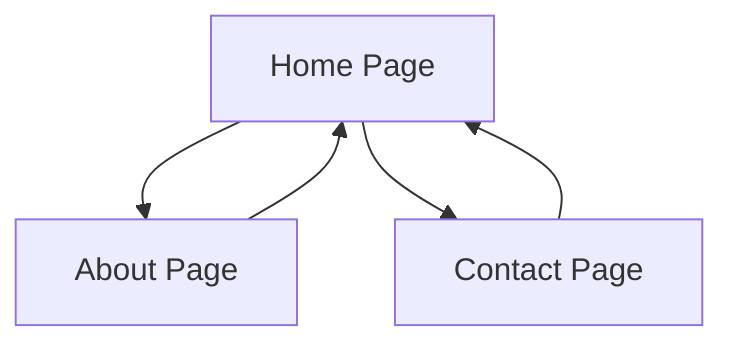
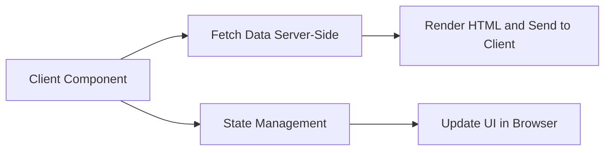
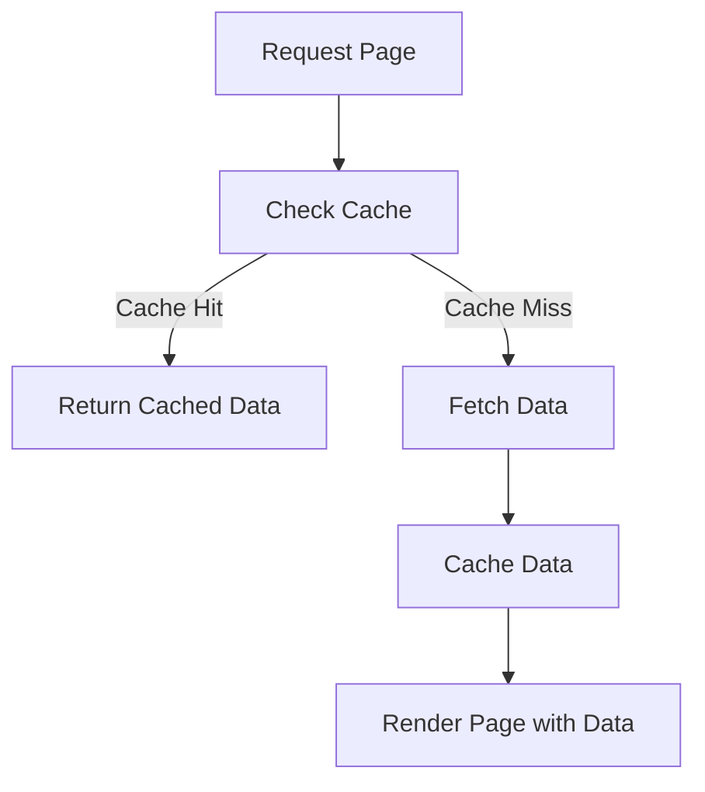
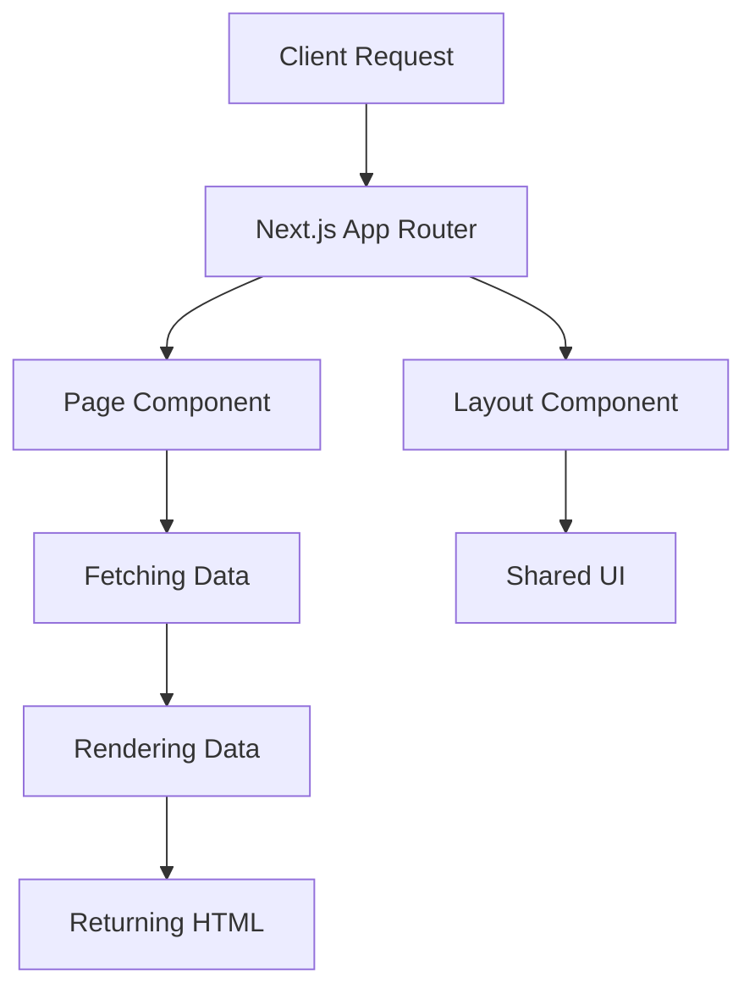

# **Next.js: From Fundamentals to Mastery - A Deep Dive into the App Router and Modern Features**

## **Getting Started**

### **Installation**

To get started with Next.js, you first need to install it in your project. This is done by creating a new Next.js application using either `npm` or `yarn`.

```bash
# Create a new Next.js application using Create Next App
npx create-next-app@latest my-next-app
# OR
yarn create next-app my-next-app
```

Once installed, navigate to the project folder and start the development server:

```bash
cd my-next-app
npm run dev
# OR
yarn dev
```

---

### **Project Structure**

A typical Next.js project follows a specific directory structure:

```
/my-next-app
  /app (for App Router, new in Next.js 13)
  /pages (legacy Pages Router, can coexist with App Router)
  /public (static assets like images)
  /styles (CSS files)
  /node_modules (dependencies)
  next.config.js (Next.js configuration file)
  package.json (project dependencies)
```

The most important part of the project structure is the `app/` and `pages/` directories. `app/` is where you will define routes using the App Router, and `pages/` is for traditional route-based file-system routing.

---

### **Layouts and Pages**

#### **Layouts**

Layouts in Next.js are used to create consistent UI elements across different pages, such as headers, footers, or sidebars. Layouts are defined in `layout.js` (or `layout.tsx` for TypeScript) and can be nested to create complex page structures.

```tsx
// layout.tsx
export default function Layout({ children }) {
    return (
        <div className="layout">
            <header>Header</header>
            <main>{children}</main>
            <footer>Footer</footer>
        </div>
    );
}
```

#### **Pages**

Pages define the actual content of each route. In the **App Router**, pages are defined as `page.js` or `page.tsx` files. These pages are rendered within the layout.

```tsx
// page.tsx
export default function HomePage() {
    return <h1>Welcome to the Home Page</h1>;
}
```

Each page corresponds to a route based on its file name or folder structure.

---

### **Linking and Navigating**

Next.js provides a built-in `Link` component to handle client-side navigation between pages. This component enables fast page transitions without reloading the browser.

```tsx
import Link from 'next/link';

export default function Nav() {
    return (
        <nav>
            <Link href="/">Home</Link>
            <Link href="/about">About</Link>
        </nav>
    );
}
```

When you use the `Link` component, Next.js pre-fetches the linked page in the background, making the navigation faster.

---

### **Mermaid Diagram: Navigation Flow**

Here’s a graph illustrating the flow of navigation in a Next.js application using the `Link` component.



---

### **Images**

Next.js comes with an **Image** component (`next/image`) that optimizes images automatically. It supports lazy loading, resizing, and serving images in modern formats (e.g., WebP).

```tsx
import Image from 'next/image';

export default function MyPage() {
    return <Image src="/my-image.jpg" alt="A cool image" width={500} height={300} />;
}
```

The `next/image` component automatically handles optimization and responsive loading, ensuring better performance.

---

### **Fonts**

To use custom fonts, you can either import them from Google Fonts or local fonts. You can use the `next/font` module for automatic font optimization.

Example of using Google Fonts:

```tsx
import { Inter } from 'next/font/google';

const inter = Inter({ subsets: ['latin'] });

export default function Home() {
    return <h1 className={inter.className}>Hello, World!</h1>;
}
```

This ensures that fonts are loaded in an optimized way.

---

### **CSS**

Next.js supports various ways to add styles to your application:

* **Global Styles**: You can add global styles in `styles/globals.css`.
* **CSS Modules**: Scoped styles that are applied only to the component they are imported in.

```tsx
// styles/Home.module.css
.title {
    color: red;
}

// In the component
import styles from './Home.module.css';
export default function Home() {
    return <h1 className={styles.title}>Welcome to Next.js</h1>;
}
```

Next.js supports **CSS-in-JS** libraries like styled-components and **Tailwind CSS** for utility-first design systems.

---

### **Server and Client Components**

#### **Server Components**

Server Components are part of Next.js 13 and above. These components allow you to write code that runs only on the server. They enable better performance by reducing the amount of JavaScript sent to the client.

```tsx
// server-component.tsx
export default async function ServerComponent() {
    const data = await fetch('https://api.example.com/data');
    return <div>{data}</div>;
}
```

#### **Client Components**

Client Components are components that run on the client-side. You can use **React hooks** and interact with the DOM directly in these components.

```tsx
'use client';
import { useState } from 'react';

export default function ClientComponent() {
    const [count, setCount] = useState(0);
    return <button onClick={() => setCount(count + 1)}>Count: {count}</button>;
}
```

---

## **Mermaid Diagram: Server vs Client Components**



---

### **Fetching Data**

Next.js provides several strategies for data fetching:

* **Server-Side Rendering (SSR)**: Using `getServerSideProps` to fetch data on each request.
* **Static Site Generation (SSG)**: Using `getStaticProps` to fetch data at build time.
* **Client-Side Fetching**: Using `useEffect` and `fetch` in components to fetch data client-side.

---

### **Caching and Revalidating**

Next.js supports **caching** and **revalidation** strategies to enhance performance:

* **Revalidate**: Set a time for when a page should be re-rendered.
* **On-Demand Revalidation**: Trigger page revalidation when required.

```tsx
// getStaticProps with revalidation
export async function getStaticProps() {
    const data = await fetchData();
    return {
        props: { data },
        revalidate: 60, // Revalidate after 60 seconds
    };
}
```

---

### **Updating Data**

To handle mutations, you can use **Server Actions** for direct server-side updates in a declarative way. This is great for form submissions and other operations that involve data modification.

```tsx
// form.tsx
export default function Form() {
    const handleSubmit = async (data) => {
        await fetch('/api/update', { method: 'POST', body: JSON.stringify(data) });
    };

    return (
        <form onSubmit={handleSubmit}>
            <button type="submit">Update</button>
        </form>
    );
}
```

---

### **Error Handling**

In Next.js, you can handle errors by using custom **Error Boundaries** with `error.js` or `error.tsx` files.

```tsx
// error.tsx
export default function Error({ error }) {
    return <div>Error occurred: {error.message}</div>;
}
```

You can also handle route-specific errors in the same way.

---

### **Partial Prerendering**

**Partial Prerendering** allows you to pre-render parts of a page statically and keep others dynamic. This provides flexibility for mixed static and dynamic content.

```tsx
// example of using static and dynamic rendering together
export async function getStaticProps() {
    const staticData = await fetchStaticData();
    return { props: { staticData } };
}
```

---

### **Metadata and OG Images**

Next.js provides utilities for managing page **metadata** like the title, description, and Open Graph images.

```tsx
// app/head.tsx
export default function Head() {
    return (
        <>
            <title>My Next.js App</title>
            <meta name="description" content="A Next.js application" />
            <meta property="og:image" content="/og-image.jpg" />
        </>
    );
}
```

---

## **Mermaid Diagram: Data Fetching and Caching Flow**



---

## **Deploying**

Next.js applications can be deployed to various platforms, including **Vercel** (which is the platform created by the creators of Next.js), **Netlify**, **AWS**, and **Google Cloud**.

To deploy on Vercel, simply push your code to a Git repository, and connect it to Vercel for automatic deployment.

---

## **Upgrading**

Upgrading Next.js is simple. You can upgrade using `npm` or `yarn`:

```bash
npm install next@latest
# OR
yarn add next@latest
```

Make sure to read the **release notes** for breaking changes when upgrading to a new version.

---

## **Guides**

Next.js provides extensive documentation and guides for various use cases such as:

* **Building Your Application**: Step-by-step tutorials to get started with features like the App Router, Server Components, etc.
* **Routing**: How to manage complex routing with the App Router and Pages Router.
* **Data Fetching**: Examples of how to fetch data using SSR, SSG, or client-side.

---

## **API Reference**

The **API reference** provides detailed information on the various functions and methods available in Next.js. This includes configuration options, CLI commands, and built-in components like `next/image` and `next/head`.

---

## **Mermaid Diagram: Next.js Architecture Overview**


