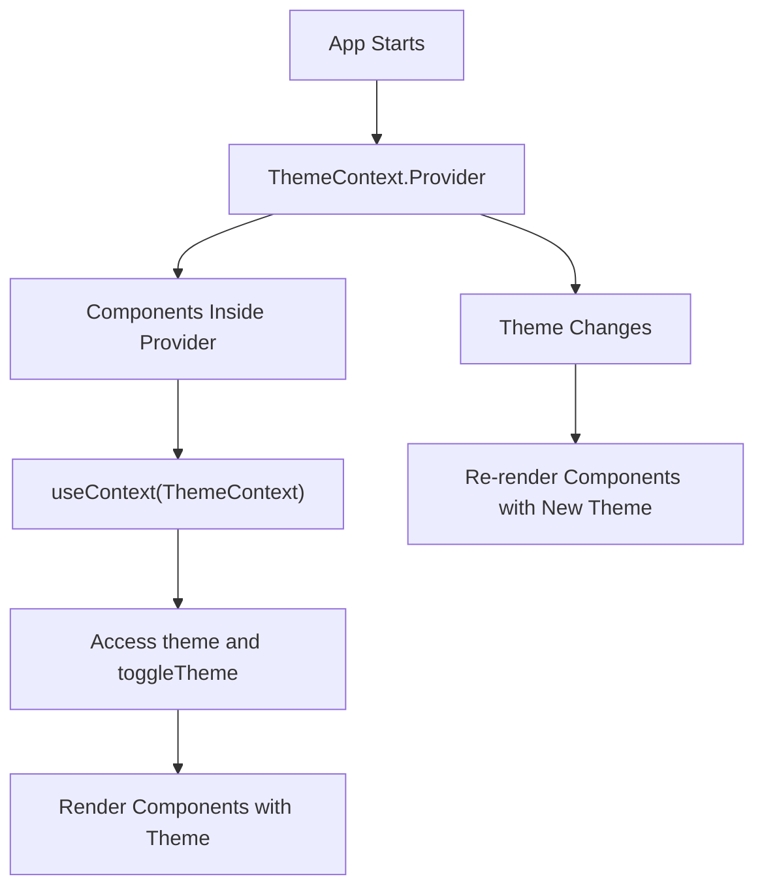

# **Context API in React**

The **Context API** in React is a powerful tool for managing and sharing state across the component tree without needing to pass props manually at each level. It allows you to create global state for your application that can be accessed by any component, no matter how deep it is in the component hierarchy.

React's Context API is especially useful in larger applications where certain data (e.g., theme settings, user authentication, language preferences) needs to be accessible throughout the app.

Let's dive into the Context API, how it works, and best practices for using it.

---

## **What is the Context API?**

The **Context API** allows you to pass data through the component tree without needing to pass props down manually at every level. It provides a way to share values like global state, theme, authentication data, or other values that are needed by many components in the app.

### **Key Concepts in the Context API:**

1. **Context**: The Context object that holds the data you want to share across the application.
2. **Provider**: A component that wraps part of your app and provides a value to the context.
3. **Consumer**: A component that consumes the context value.
4. **useContext**: A React hook that allows functional components to access context values.

---

## **How Does the Context API Work?**

The Context API works by creating a **Context object**, which has two main parts:

1. **Provider**: A component that holds the data you want to share and makes it available to all the components inside its tree.
2. **Consumer**: A component that uses the `useContext` hook to access the data provided by the `Provider`.

---

## **Creating a Context**

To use the Context API, we first need to create a context using `React.createContext()`. This will create a **Context object**.

### **Syntax:**

```jsx
const MyContext = React.createContext(defaultValue);
```

* `defaultValue` is the initial value of the context (it can be any JavaScript value: string, number, object, etc.). If no value is provided to the `Provider`, the context will fall back to this default value.

---

## **Example: Basic Usage of Context API**

Let's create a simple example of a theme toggle using the Context API.

### **Step 1: Create a Context for the Theme**

```jsx
// ThemeContext.js
import React, { createContext, useState } from 'react';

// Create a Context with a default value
const ThemeContext = createContext('light'); // 'light' is the default theme

export const ThemeProvider = ({ children }) => {
  const [theme, setTheme] = useState('light');

  // Toggle the theme between 'light' and 'dark'
  const toggleTheme = () => {
    setTheme((prevTheme) => (prevTheme === 'light' ? 'dark' : 'light'));
  };

  return (
    <ThemeContext.Provider value={{ theme, toggleTheme }}>
      {children}
    </ThemeContext.Provider>
  );
};

export default ThemeContext;
```

### **Step 2: Using the Context in a Component**

Now that we have created the context and a provider (`ThemeProvider`), we can access the `theme` value in any component by using the `useContext` hook.

```jsx
// ThemedComponent.js
import React, { useContext } from 'react';
import ThemeContext from './ThemeContext';

const ThemedComponent = () => {
  const { theme, toggleTheme } = useContext(ThemeContext);

  return (
    <div style={{ backgroundColor: theme === 'light' ? '#fff' : '#333', color: theme === 'light' ? '#000' : '#fff' }}>
      <h1>The current theme is {theme}</h1>
      <button onClick={toggleTheme}>Toggle Theme</button>
    </div>
  );
};

export default ThemedComponent;
```

### **Step 3: Wrap the Application with the Provider**

To make the context available to the components, we need to wrap the app with the `ThemeProvider` (which contains the `Provider` component) in the main entry point of the app (usually `App.js` or `index.js`).

```jsx
// App.js
import React from 'react';
import { ThemeProvider } from './ThemeContext'; // Import the ThemeProvider
import ThemedComponent from './ThemedComponent';

const App = () => {
  return (
    <ThemeProvider>
      <ThemedComponent />
    </ThemeProvider>
  );
};

export default App;
```

### **Explanation:**

* **`ThemeContext.Provider`**: The `Provider` component holds the state (in this case, `theme`) and makes it available to all components inside it.
* **`useContext(ThemeContext)`**: The `useContext` hook allows functional components to access the `theme` value and the `toggleTheme` function from the context.
* **`ThemeProvider`**: The `ThemeProvider` component wraps the part of the app that needs access to the theme context.

---

## **When to Use the Context API**

You should use the **Context API** when you need to share data between components without passing props manually through each level of the component tree. It is particularly useful in the following cases:

1. **Global State**: For sharing state that needs to be accessible across many components (e.g., user authentication, theme settings, language preference).
2. **Avoid Prop Drilling**: When passing props down multiple layers of components becomes cumbersome and hard to manage.
3. **Reusable Logic**: When you need to encapsulate and share business logic or state logic across different parts of your application.

---

## **Best Practices for Using the Context API**

While the Context API is powerful, there are some best practices to keep in mind:

1. **Avoid Overuse of Context**:

   * While the Context API is great for global state, overusing it or using it for everything can lead to performance issues, especially when you have large context values or a lot of components consuming the context.
   * Instead of using context for everything, try using local state and only use context for data that needs to be shared across multiple components.

2. **Splitting Context for Better Performance**:

   * If you have a large context value that doesn’t need to be accessed by all components, split it into smaller contexts to reduce unnecessary re-renders.
   * For example, if you have `theme` and `user` in the same context, consider separating them into `ThemeContext` and `UserContext` to limit re-renders to only those components that need one or the other.

3. **Memoization**:

   * If you pass a function through context (like `toggleTheme`), ensure that it is **memoized** using `useCallback` to avoid re-creating the function on every render.

   ```jsx
   const toggleTheme = useCallback(() => {
     setTheme(prev => (prev === 'light' ? 'dark' : 'light'));
   }, []);
   ```

4. **Use Default Values Wisely**:

   * Set meaningful default values for the context to handle cases when the context is accessed outside of the `Provider`.
   * Default values act as fallbacks when no provider is found above a component in the tree.

---

## **Mermaid Diagram: Context API Flow**



In the diagram:

1. The app starts and the **`ThemeContext.Provider`** wraps the components that need access to the context.
2. The child components use the `useContext` hook to access the context data (like `theme` and `toggleTheme`).
3. When the theme changes, only components consuming the context are re-rendered.

---

## **Conclusion**

The **Context API** is an essential tool in React for managing global state and avoiding the pain of prop drilling. It allows you to share data efficiently across your component tree and is especially useful in larger applications where multiple components need to access and update shared data.

### **Key Points:**

* **`createContext`**: Creates a context object to hold the data.
* **`Provider`**: Supplies the context value to the component tree.
* **`useContext`**: Consumes the context value in functional components.
* **Best practices**: Use context for global state management, avoid overuse, and split context when necessary for performance optimization.

By using the Context API effectively, you can simplify state management in your React application, make your components more reusable, and create a more maintainable codebase.
