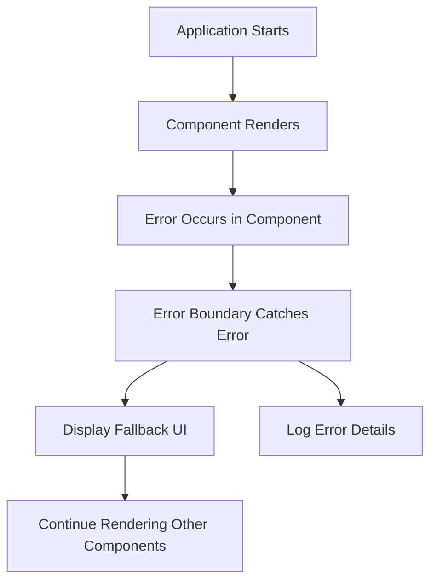

# **Error Boundaries in React**

In a React application, errors can happen for various reasons, such as faulty logic, network failures, or bugs in third-party libraries. In production, these errors can cause the app to crash, leading to a poor user experience. To address this, React introduced **Error Boundaries**—a powerful mechanism for handling JavaScript errors and rendering a fallback UI instead of crashing the entire component tree.

### **What is an Error Boundary?**

An **Error Boundary** is a React component that catches JavaScript errors anywhere in its child component tree, logs those errors, and displays a fallback UI. This prevents the entire app from crashing due to runtime errors in any specific part of the component tree.

Error boundaries catch errors in:

* The component’s render method.
* The lifecycle methods (`componentDidMount`, `componentDidUpdate`, `componentWillUnmount`).
* Event handlers (though, for event handlers, it’s usually better to handle errors locally).

---

## **How Error Boundaries Work**

1. **Catching Errors**: An error boundary uses the `componentDidCatch` lifecycle method to catch errors that occur in its child components.
2. **Displaying a Fallback UI**: When an error occurs, the error boundary can render a fallback UI instead of the component that crashed.
3. **Preserving Application State**: The rest of the application continues to work as expected, ensuring that only the part of the UI affected by the error is replaced with a fallback.

---

## **Creating an Error Boundary**

### **1. Class Component-based Error Boundary**

Error boundaries can only be created using class components (not functional components) because they rely on lifecycle methods. The key lifecycle methods used are `static getDerivedStateFromError()` and `componentDidCatch()`.

#### **Syntax:**

* `getDerivedStateFromError()`: This method is invoked when an error is caught. It returns an object that will update the state to render a fallback UI.
* `componentDidCatch()`: This method is invoked after an error is caught and is typically used for logging the error.

### **Example:**

```jsx
import React, { Component } from 'react';

class ErrorBoundary extends Component {
  constructor(props) {
    super(props);
    this.state = { hasError: false, errorInfo: null };
  }

  // This lifecycle method is called when an error is thrown in a child component
  static getDerivedStateFromError(error) {
    // Update state to display fallback UI
    return { hasError: true };
  }

  // This method logs the error details to an error reporting service
  componentDidCatch(error, errorInfo) {
    this.setState({ errorInfo });
    // Log the error details to an external logging service (e.g., Sentry, LogRocket)
    console.log("Error caught:", error, errorInfo);
  }

  render() {
    if (this.state.hasError) {
      return (
        <div>
          <h2>Something went wrong.</h2>
          {/* Optional: Show the error information */}
          <details style={{ whiteSpace: 'pre-wrap' }}>
            {this.state.errorInfo && this.state.errorInfo.componentStack}
          </details>
        </div>
      );
    }

    return this.props.children;
  }
}

export default ErrorBoundary;
```

### **Usage:**

To use an error boundary, simply wrap it around the component tree where you want to catch errors.

```jsx
import React from 'react';
import ErrorBoundary from './ErrorBoundary'; // Import the error boundary component
import MyComponent from './MyComponent';

const App = () => {
  return (
    <ErrorBoundary>
      <MyComponent />
    </ErrorBoundary>
  );
};

export default App;
```

In this example:

* If `MyComponent` or any of its children throw an error, the `ErrorBoundary` will catch the error and display the fallback UI.
* The `componentDidCatch` method allows us to log the error and stack trace for debugging purposes.

---

## **When to Use Error Boundaries**

Error boundaries are not required in every part of your React application, but they are particularly useful in the following cases:

* **Critical UI Components**: Components that have complex logic and could potentially throw errors. For example, components dealing with external data (API calls) or third-party libraries.
* **Error Handling in Third-Party Libraries**: Wrapping third-party UI components that might throw errors during rendering or event handling.
* **Large Apps with Multiple Components**: To prevent the entire application from crashing when a small part of the app encounters an error.

### **Example: Using Error Boundaries for a List of Components**

Suppose you have a list of components, and one of them might throw an error due to some invalid data. Wrapping each of them in an error boundary ensures that if one component fails, the rest of the application is not affected.

```jsx
import React from 'react';
import ErrorBoundary from './ErrorBoundary'; // Assuming the ErrorBoundary component is imported
import ListItem from './ListItem';

const List = ({ items }) => {
  return (
    <div>
      {items.map((item, index) => (
        <ErrorBoundary key={index}>
          <ListItem item={item} />
        </ErrorBoundary>
      ))}
    </div>
  );
};
```

In this example, each `ListItem` is wrapped in an error boundary, so if one of them throws an error, only that item will be affected and not the entire list.

---

## **Handling Errors in Functional Components**

In **React functional components**, you cannot directly use error boundaries because they require lifecycle methods that are available only in class components. However, you can still catch errors locally using a combination of `try...catch` inside functions, and combine that with **Error Boundaries** in class components for broader error handling.

For more fine-grained error handling within functional components, you can use **try-catch** blocks or custom error handling hooks.

---

## **Mermaid Diagram: Error Boundary Flow**



In the diagram above:

1. The application starts, and components render.
2. An error occurs in a component.
3. The **Error Boundary** catches the error and prevents the crash.
4. A **Fallback UI** is displayed, and the error details are logged.
5. The rest of the application continues rendering normally.

---

## **Best Practices for Error Boundaries**

1. **Wrap critical parts of your application**: Only wrap parts of the app that are prone to errors with error boundaries. Wrapping the entire app may lead to less effective error handling and can hinder debugging.
2. **Provide useful fallback UI**: Make sure your fallback UI informs the user that something went wrong and provides a way to continue using the app.
3. **Use logging and error tracking**: Always log the errors (e.g., using services like Sentry or LogRocket) to help diagnose and fix issues in production.
4. **Handle errors gracefully**: Consider offering users the option to retry an operation or report an error, instead of just showing a generic message.

---

## **Conclusion**

**Error Boundaries** are a powerful feature in React that help prevent entire applications from crashing due to errors in any specific part of the component tree. By using error boundaries effectively, you can isolate and handle errors gracefully, improve the user experience, and ensure that your application remains resilient and fault-tolerant.

Key Takeaways:

* Error boundaries help catch errors in child components.
* Only class components can be used to create error boundaries.
* They allow you to render fallback UI and log errors for debugging.
* Use error boundaries strategically to handle errors in critical components or large parts of your app.
