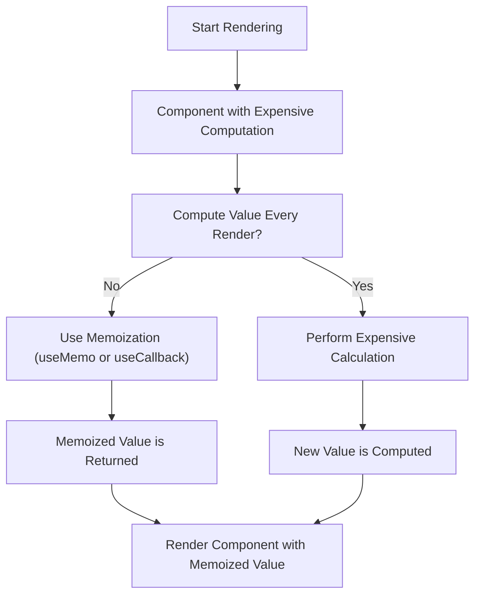

# **Memoization in React**

Memoization is an optimization technique that stores the results of expensive function calls and reuses them when the same inputs occur again. In React, memoization helps to avoid unnecessary re-renders of components and expensive recalculations, which can improve performance, especially in larger applications.

React provides two main hooks for memoization:

1. **`useMemo`** - For memoizing computed values.
2. **`useCallback`** - For memoizing functions.

Let’s explore both of these hooks and how to use them to optimize your React components.

---

## **1. `useMemo` Hook**

### **What is `useMemo`?**

The `useMemo` hook memorizes the result of an expensive computation so that it doesn't need to be recalculated on every render. It only recalculates when one of its dependencies changes. This can significantly improve performance by avoiding unnecessary re-computation of values.

### **Syntax:**

```jsx
const memoizedValue = useMemo(() => expensiveFunction(arg1, arg2), [arg1, arg2]);
```

* `expensiveFunction(arg1, arg2)`: The function whose result you want to memoize.
* `[arg1, arg2]`: The dependencies array. React will only recompute the memoized value when one of the dependencies changes.

### **Example:**

```jsx
import React, { useState, useMemo } from 'react';

const ExpensiveComputation = ({ a, b }) => {
  const computeExpensiveValue = (a, b) => {
    console.log('Computing...');
    return a + b;
  };

  // Memoizing the expensive computation
  const result = useMemo(() => computeExpensiveValue(a, b), [a, b]);

  return <div>Result: {result}</div>;
};

const App = () => {
  const [a, setA] = useState(0);
  const [b, setB] = useState(0);

  return (
    <div>
      <ExpensiveComputation a={a} b={b} />
      <button onClick={() => setA(a + 1)}>Increment A</button>
      <button onClick={() => setB(b + 1)}>Increment B</button>
    </div>
  );
};

export default App;
```

### **Explanation:**

* `useMemo` ensures that `computeExpensiveValue` is only re-executed when `a` or `b` changes. If either `a` or `b` hasn't changed between renders, React will return the memoized value without recalculating it.
* This avoids unnecessary re-computation, which can be particularly useful when dealing with large datasets or complex calculations.

---

## **2. `useCallback` Hook**

### **What is `useCallback`?**

The `useCallback` hook is similar to `useMemo`, but it is used specifically for memoizing functions. It prevents a function from being re-created on every render unless one of its dependencies changes. This is useful when passing functions to child components, especially if those components rely on reference equality to avoid unnecessary re-renders.

### **Syntax:**

```jsx
const memoizedCallback = useCallback(() => {
  // Your function logic here
}, [dependencies]);
```

* `memoizedCallback`: The memoized version of the function.
* `[dependencies]`: The dependencies array. React will only recreate the function if one of the dependencies has changed.

### **Example:**

```jsx
import React, { useState, useCallback } from 'react';

const Button = ({ onClick }) => {
  console.log('Button rendered');
  return <button onClick={onClick}>Click Me</button>;
};

const App = () => {
  const [count, setCount] = useState(0);

  // Memoizing the callback function to avoid re-creating it on each render
  const handleClick = useCallback(() => {
    setCount(count + 1);
  }, [count]);

  return (
    <div>
      <p>Count: {count}</p>
      <Button onClick={handleClick} />
    </div>
  );
};

export default App;
```

### **Explanation:**

* The `handleClick` function is wrapped with `useCallback` to ensure it is not recreated on every render unless the `count` value changes.
* This is particularly useful when passing `handleClick` as a prop to the `Button` component, preventing unnecessary re-renders of `Button`.

---

## **Why Use `useMemo` and `useCallback`?**

Both `useMemo` and `useCallback` are performance optimizations, but they are useful in different situations:

* **`useMemo`** is helpful when you need to memoize **computed values** that involve expensive calculations, such as sorting large lists, filtering data, or performing complex mathematical operations.
* **`useCallback`** is useful when you need to memoize **functions** to avoid unnecessary re-creations of those functions, particularly when passing them as props to child components that rely on reference equality to prevent re-renders.

### **When Not to Use:**

* Don’t use `useMemo` or `useCallback` prematurely. If the computation or function is not expensive, it may add unnecessary complexity without any performance gain.
* React is highly optimized, and in many cases, React’s default behavior (without memoization) is sufficient. Memoization should be considered primarily for performance bottlenecks.

---

## **3. Memoization for Lists and Dynamic Data**

When rendering large lists or complex data structures, memoization can provide a significant performance boost by preventing unnecessary re-renders of unchanged items.

### **Example: Memoizing List Items**

```jsx
import React, { useState, useMemo } from 'react';

const ListItem = React.memo(({ item }) => {
  console.log(`Rendering: ${item}`);
  return <div>{item}</div>;
});

const MyList = () => {
  const [count, setCount] = useState(0);
  const items = useMemo(() => Array.from({ length: 1000 }, (_, i) => `Item ${i + 1}`), []);

  return (
    <div>
      <button onClick={() => setCount(count + 1)}>Increment Count</button>
      <div>Count: {count}</div>
      {items.map((item, index) => (
        <ListItem key={index} item={item} />
      ))}
    </div>
  );
};

export default MyList;
```

### **Explanation:**

* `useMemo` is used to memoize the `items` array. The array is only recalculated if one of its dependencies changes. Since `items` doesn’t depend on any dynamic state, it will be calculated only once, preventing unnecessary re-computation on each render.
* `ListItem` is memoized using `React.memo`, which ensures that each item is only re-rendered if its `item` prop changes. This prevents re-rendering all list items if only the `count` value changes.

---

## **4. Performance Pitfalls to Avoid**

While memoization can significantly improve performance, there are some common pitfalls to avoid:

1. **Overusing `useMemo` and `useCallback`**:

   * React’s built-in optimizations are already efficient in many cases. Memoizing values or functions for every minor change can actually hurt performance due to the overhead of tracking dependencies.
   * Memoization should be used primarily for **expensive calculations** or **functions passed down to deeply nested components**.

2. **Avoid Using Memoization for Simple Data**:

   * Simple or small data structures (like a few strings or numbers) don’t benefit from memoization. React's default rendering is already highly optimized for such cases.

3. **Re-Memoizing Unnecessary Values**:

   * Be cautious of creating new objects or arrays inside the `useMemo` hook. React will treat these as new objects, even if the content hasn’t changed.

```jsx
// Inefficient: new object created every time
const memoizedValue = useMemo(() => ({ name: 'John' }), []);

// Better: Ensure stable references
const memoizedValue = useMemo(() => ['John'], []);
```

---

## **Mermaid Diagram: Memoization in React**



---

## **Conclusion**

Memoization in React, via the `useMemo` and `useCallback` hooks, is an important optimization technique to improve performance, particularly in applications with expensive calculations or large lists. By memoizing values and functions, you can reduce unnecessary re-renders, improve responsiveness, and enhance the user experience.

**Key Takeaways:**

* Use `useMemo` for memoizing expensive calculations and values.
* Use `useCallback` for memoizing functions to avoid re-creating them on every render.
* Use memoization wisely and avoid overuse, as unnecessary memoization can lead to performance issues.
