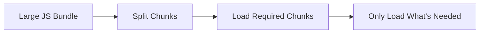

# **Optimizing Performance of a Web Application in React**

Performance optimization is a critical factor when building modern web applications. A performant React app ensures better user experience, faster loading times, and higher engagement rates. In this guide, we’ll dive deep into various strategies and techniques to optimize the performance of React applications. We'll use examples, best practices, and diagrams for clarity.

---

## **Key Areas of Performance Optimization in React**

1. **Rendering Optimization**
2. **Reducing Repaints and Reflows**
3. **Code Splitting**
4. **Efficient State Management**
5. **Lazy Loading**
6. **Memoization and Pure Components**
7. **Virtualization of Large Lists**
8. **Optimizing Images and Media**
9. **Web Vitals and Metrics**
10. **Server-Side Rendering (SSR) and Static Site Generation (SSG)**

---

## **1. Rendering Optimization**

React’s rendering process can be slow if unnecessary re-renders are triggered. Optimizing rendering is crucial for improving performance.

### **React.memo and PureComponent**

* **React.memo** is a higher-order component (HOC) that memorizes a component and only re-renders it when its props change.
* **PureComponent** is a class component that only re-renders if the state or props have changed shallowly.

**Example: Using `React.memo`**

```tsx
const MyComponent = React.memo(({ name }) => {
    console.log('Rendering', name);
    return <div>{name}</div>;
});

// This will only re-render when `name` changes
<MyComponent name="Alice" />
<MyComponent name="Bob" />
```

**Example: Using `PureComponent`**

```tsx
class MyComponent extends React.PureComponent {
    render() {
        return <div>{this.props.name}</div>;
    }
}
```

### **Avoiding Unnecessary Re-Renders**

Unnecessary re-renders can be avoided by:

1. **Using keys in lists**: React uses keys to identify which items in the list have changed, added, or removed.
2. **Optimizing `shouldComponentUpdate` lifecycle**: In class components, implement the `shouldComponentUpdate` method to prevent unnecessary updates.

---

## **2. Reducing Repaints and Reflows**

Repaints and reflows occur when the layout or style of the page changes. Frequent reflows can hurt performance.

* **Use CSS classes instead of inline styles** for better performance.
* **Avoid frequent layout changes** during animation, such as modifying styles that trigger reflow (e.g., `width`, `height`, `top`, `left`).

**Example: Avoiding Reflow**

```tsx
// Avoid inline styles that change frequently
<button style={{ width: this.state.width }}>Click Me</button>
```

Instead, use **CSS animations** or **transform** for changes that don’t trigger reflow:

```tsx
<button className="anim-button">Click Me</button>
```

---

## **3. Code Splitting**

**Code Splitting** is the practice of breaking up the large bundle of JavaScript files into smaller chunks and loading only what’s needed.

* **React.lazy**: Dynamically import components only when they are needed.

**Example: Code Splitting with `React.lazy`**

```tsx
const MyComponent = React.lazy(() => import('./MyComponent'));

const App = () => (
  <React.Suspense fallback={<div>Loading...</div>}>
    <MyComponent />
  </React.Suspense>
);
```

* **Webpack**: Use Webpack’s **`SplitChunksPlugin`** to automatically split the code.

### **Mermaid Diagram: Code Splitting Process**



---

## **4. Efficient State Management**

Inefficient state management leads to performance issues like excessive renders.

### **Use Local State and Context API Wisely**

* Keep state local where possible, and avoid using Context API for frequently changing values.

**Example: Use local state instead of Context API for frequent updates**

```tsx
// Prefer useState over context for local updates
const Counter = () => {
  const [count, setCount] = useState(0);
  return (
    <div>
      <p>{count}</p>
      <button onClick={() => setCount(count + 1)}>Increment</button>
    </div>
  );
};
```

### **Avoid Prop Drilling**

Use Context API or other state management libraries like Redux for managing global state.

---

## **5. Lazy Loading**

**Lazy loading** defers loading non-critical resources until they are needed. This can be applied to components, images, and assets.

### **Lazy Loading Components**

```tsx
const LazyComponent = React.lazy(() => import('./LazyComponent'));

const App = () => (
  <React.Suspense fallback={<div>Loading...</div>}>
    <LazyComponent />
  </React.Suspense>
);
```

### **Lazy Loading Images and Assets**

Use the native `loading="lazy"` attribute for images and iframes:

```html

```

---

## **6. Memoization and Pure Components**

**Memoization** is a technique used to store the result of expensive function calls and reuse the result when the same inputs occur again. React offers `useMemo` and `useCallback` hooks for this.

* **`useMemo`** memorizes the result of a function call.
* **`useCallback`** memorizes the function itself.

### **Example: Using `useMemo`**

```tsx
const expensiveComputation = (a, b) => {
    console.log('Computing...');
    return a + b;
};

const MyComponent = ({ a, b }) => {
    const result = useMemo(() => expensiveComputation(a, b), [a, b]);
    return <div>{result}</div>;
};
```

---

## **7. Virtualization of Large Lists**

When rendering a large number of items (like a long list or table), use **virtualization** to only render items in the viewport. This helps in reducing the load time and memory usage.

### **Example: Using `react-window`**

```tsx
import { FixedSizeList as List } from 'react-window';

const MyList = () => {
  return (
    <List
      height={150}
      itemCount={1000}
      itemSize={35}
      width={300}
    >
      {({ index, style }) => (
        <div style={style}>Item {index}</div>
      )}
    </List>
  );
};
```

---

## **8. Optimizing Images and Media**

Large images and videos can severely impact performance. Optimizing these assets is crucial.

### **Use the `next/image` Component** (for Next.js applications)

Next.js optimizes images by default when using the `Image` component.

```tsx
import Image from 'next/image';

const MyImage = () => (
  <Image src="/path/to/image.jpg" alt="Image" width={500} height={300} />
);
```

For other applications:

* Compress images using tools like **ImageOptim**, **TinyPNG**, or **SVGO**.
* Use modern image formats like **WebP** for better compression.

---

## **9. Web Vitals and Metrics**

Measuring web performance with **Web Vitals** helps identify critical performance issues.

* **Largest Contentful Paint (LCP)**: Measures how long it takes for the largest content to load.
* **First Input Delay (FID)**: Measures the time it takes for the page to become interactive.
* **Cumulative Layout Shift (CLS)**: Measures how much the layout shifts as the page loads.

### **Use `web-vitals` Library**

You can use the **web-vitals** library to measure these metrics and send them to an analytics tool.

```bash
npm install web-vitals
```

```tsx
import { reportWebVitals } from 'web-vitals';

reportWebVitals(console.log);
```

---

## **10. Server-Side Rendering (SSR) and Static Site Generation (SSG)**

Both SSR and SSG improve initial page load performance by rendering the page on the server before sending it to the client.

* **SSR**: Pages are rendered on the server at request time.
* **SSG**: Pages are pre-rendered at build time.

### **Example: Using SSR in Next.js**

```tsx
export async function getServerSideProps() {
  const data = await fetchData();
  return {
    props: { data },
  };
}
```

### **Example: Using SSG in Next.js**

```tsx
export async function getStaticProps() {
  const data = await fetchData();
  return {
    props: { data },
    revalidate: 10, // Revalidate every 10 seconds
  };
}
```

---

## **Mermaid Diagram: Optimizing React Performance**

```mermaid
graph LR
    A[Start] --> B[Rendering Optimization]
    B --> C[React.memo & PureComponent]
    C --> D[Code Splitting]
    D --> E[Lazy Loading]
    E --> F[State Management]
    F --> G[Memoization]
    G --> H[Virtualization of Lists]
    H --> I[Image Optimization]
    I --> J[Web Vitals & Metrics]
    J --> K[SSR & SSG]
    K --> L[End]
```



---

## **Conclusion**

Optimizing the performance of a React application requires a comprehensive approach. By focusing on:

1. **Rendering optimizations** (e.g., React.memo, PureComponent),
2. **Efficient state management**,
3. **Code splitting**,
4. **Lazy loading**,
5. **Virtualization**,
6. **Image and media optimizations**, and
7. **Server-Side Rendering (SSR) / Static Site Generation (SSG)**,

you can significantly improve your application's performance, ensuring a smoother and faster user experience.
