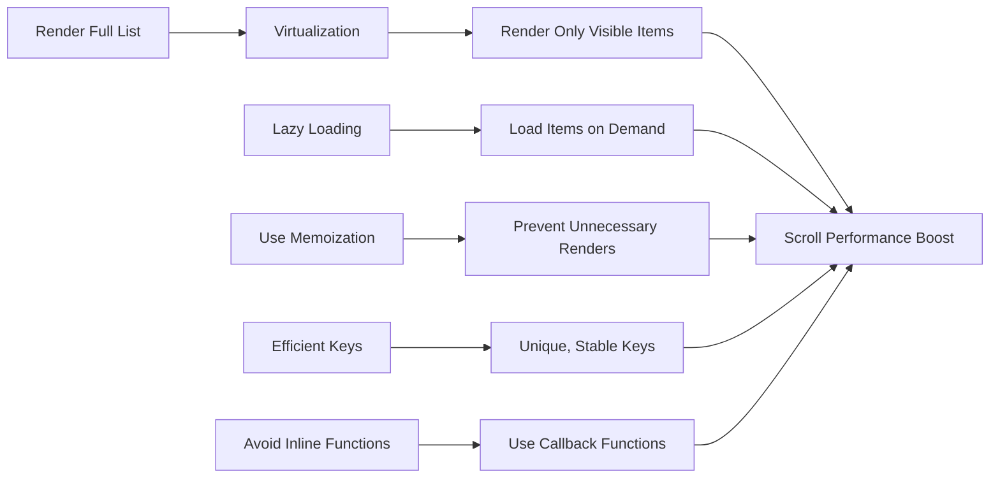

# **Optimizing React App Performance with Large Lists**

Rendering large lists of data in React can significantly impact performance, especially when the list contains hundreds or thousands of items. As the number of items in the list increases, React may be forced to re-render a lot of components, leading to performance bottlenecks and slower page loads. To optimize the performance of large lists in React, you can use several techniques such as **virtualization**, **memoization**, **lazy loading**, and **efficient rendering techniques**.

In this guide, we’ll explore these techniques and how to implement them to optimize large lists in React applications.

---

## **1. Virtualization**

### **What is Virtualization?**

**Virtualization** refers to rendering only the items that are currently visible in the viewport, rather than rendering the entire list. This technique drastically reduces the number of DOM nodes React needs to manage, improving rendering performance.

React provides libraries like **react-window** and **react-virtualized** that make it easier to implement virtualization.

### **How Virtualization Works:**

1. **Render Only Visible Items**: Instead of rendering all items in a list, render only the items that are visible in the viewport.
2. **Dynamic Item Rendering**: As the user scrolls, items outside the viewport are removed from the DOM, and new items that come into view are added.
3. **Efficient Memory Usage**: By rendering only a small subset of the list, memory consumption is reduced.

### **Example with `react-window`:**

```bash
npm install react-window
```

```jsx
import { FixedSizeList as List } from 'react-window';

const items = Array(1000).fill().map((_, index) => `Item ${index + 1}`);

const MyList = () => {
  return (
    <List
      height={400}      // Height of the list container
      itemCount={items.length} // Number of items
      itemSize={35}      // Height of each item
      width={300}        // Width of the list container
    >
      {({ index, style }) => (
        <div style={style}>{items[index]}</div>
      )}
    </List>
  );
};

export default MyList;
```

In this example, `react-window` will only render the visible items within the `height` of the container (`400px`), and as you scroll, the items outside the viewport will be removed and replaced by new items in the viewport.

---

## **2. Memoization**

### **What is Memoization?**

**Memoization** is a performance optimization technique that involves caching the results of expensive function calls and reusing the cached result when the same inputs occur again. In React, you can memoize components to prevent unnecessary re-renders.

### **How Memoization Helps in List Rendering:**

* **Prevent unnecessary re-renders**: If a list item’s data hasn’t changed, memoizing the list item component ensures it doesn’t re-render unnecessarily.
* **Improves rendering performance**: React only re-renders components that need to be updated, which is particularly useful in large lists where only a small number of items change.

### **Example with `React.memo`:**

```jsx
import React, { useState } from 'react';

// Memoizing List Item to prevent unnecessary re-renders
const ListItem = React.memo(({ item }) => {
  console.log('Rendering:', item);
  return <div>{item}</div>;
});

const MyList = () => {
  const [items] = useState(Array(1000).fill().map((_, index) => `Item ${index + 1}`));

  return (
    <div>
      {items.map(item => (
        <ListItem key={item} item={item} />
      ))}
    </div>
  );
};

export default MyList;
```

In this example:

* `ListItem` is memoized using `React.memo`, which ensures that each list item component is only re-rendered if its `item` prop changes.

---

## **3. Lazy Loading**

### **What is Lazy Loading?**

**Lazy loading** involves deferring the loading of components or data until they are needed. In the case of large lists, lazy loading can be used to load only parts of the list as the user scrolls.

### **How Lazy Loading Helps:**

* **Initial Page Load**: The application initially loads only a small portion of the list, which reduces the initial page load time.
* **On-Demand Loading**: As the user scrolls, more items are dynamically loaded into the view, which reduces the overall memory footprint.

### **Example with Intersection Observer (Lazy Loading on Scroll):**

```jsx
import React, { useState, useEffect, useRef } from 'react';

const LazyList = () => {
  const [items, setItems] = useState([]);
  const loader = useRef(null);

  // Simulate fetching more data
  const loadMoreItems = () => {
    const newItems = Array(20).fill().map((_, index) => `Item ${items.length + index + 1}`);
    setItems(prevItems => [...prevItems, ...newItems]);
  };

  useEffect(() => {
    loadMoreItems(); // Initial load

    const observer = new IntersectionObserver(
      (entries) => {
        if (entries[0].isIntersecting) {
          loadMoreItems();
        }
      },
      { threshold: 1 }
    );

    if (loader.current) {
      observer.observe(loader.current);
    }

    return () => observer.disconnect();
  }, [items]);

  return (
    <div>
      {items.map((item, index) => (
        <div key={index}>{item}</div>
      ))}
      <div ref={loader} style={{ height: '20px', backgroundColor: 'lightgray' }}>
        Loading more items...
      </div>
    </div>
  );
};

export default LazyList;
```

In this example:

* **Intersection Observer** is used to detect when the "loading more" indicator reaches the viewport. When it does, more items are fetched and added to the list.
* This ensures that only a small subset of items is loaded initially, and more items are loaded dynamically as the user scrolls.

---

## **4. Efficient Key Usage**

### **Why Are Keys Important?**

Keys are critical for efficiently updating lists in React. React uses the `key` prop to identify which items have changed, been added, or removed, ensuring minimal re-renders and avoiding unnecessary DOM changes.

### **Best Practices for Keys:**

* **Use Unique, Stable Keys**: Always provide a unique `key` prop to each item in a list. Use a unique identifier like an `id` or a database key.
* **Avoid Using Index as Key**: Using the index as a key can cause issues during updates when the list order changes.

### **Example:**

```jsx
const MyList = ({ items }) => {
  return (
    <div>
      {items.map(item => (
        <div key={item.id}>{item.name}</div>
      ))}
    </div>
  );
};
```

Here, each item is given a unique `id` key, ensuring that React can efficiently identify and update only the necessary DOM elements.

---

## **5. Avoiding Inline Functions in List Rendering**

### **Why Avoid Inline Functions?**

Defining functions inline within render methods or in JSX (like `onClick={() => handleClick()}`) creates new instances of the function on every render. This can trigger unnecessary re-renders of child components, especially in large lists.

### **Solution:**

Instead of creating new functions inline, define them outside of the render method or use `useCallback` to memoize functions.

### **Example:**

```jsx
const MyList = ({ items }) => {
  const handleClick = (item) => {
    console.log(item);
  };

  return (
    <div>
      {items.map(item => (
        <div key={item.id} onClick={() => handleClick(item)}>
          {item.name}
        </div>
      ))}
    </div>
  );
};
```

In this case, `handleClick` is defined outside the render method, ensuring that React doesn't recreate it on every render.

---

## **Mermaid Diagram: Optimizing Large Lists**



In the diagram above:

1. **Virtualization** reduces the number of rendered items by only showing what's visible.
2. **Memoization** avoids unnecessary re-renders by caching results.
3. **Lazy Loading** loads items on demand, improving initial load performance.
4. **Efficient Keys** ensure React can optimize re-renders.
5. **Avoid Inline Functions** to prevent unnecessary function recreations.

---

## **Conclusion**

Optimizing large lists in React is essential for maintaining performance, especially as your data grows. Using techniques like **virtualization**, **memoization**, **lazy loading**, and **efficient key usage** can significantly improve the responsiveness and performance of your application. Always consider these best practices to ensure smooth rendering and a better user experience as your application scales.
