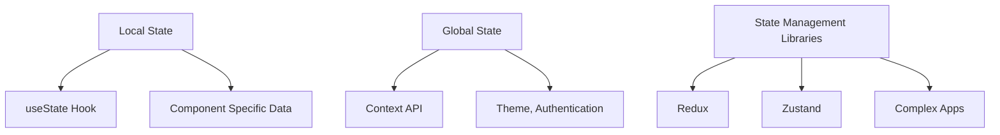

# **State Management in Complex Applications**

As applications grow and become more complex, managing state across components and modules becomes more challenging. In React, state management is crucial for building responsive and dynamic user interfaces. There are various ways to manage state, ranging from **local state** to more complex global state management solutions. Let's break down the key strategies for state management in React applications.

---

## **1. Local State**

### **Definition:**

**Local State** is state that is managed within a single component. It's ideal for component-specific UI states like toggles, input values, or form fields that don't need to be shared across multiple components.

React provides the `useState` hook to manage local state.

### **Example:**

```jsx
import React, { useState } from 'react';

function Counter() {
  const [count, setCount] = useState(0);

  return (
    <button onClick={() => setCount(count + 1)}>
      Count: {count}
    </button>
  );
}
```

**How It Works:**

* `useState(0)` initializes the state with a value of `0`.
* `setCount` updates the state when the button is clicked.
* Local state is scoped to the `Counter` component, meaning only this component can access and modify it.

### **When to Use Local State:**

* For UI-specific elements that don't need to be shared globally.
* Example: A toggle switch, an input field, or a form's input value.

---

## **2. Global State**

### **Definition:**

**Global State** is used when data needs to be shared across many components in an application. For example, user authentication status, theme settings, or language preferences.

React provides the **Context API** for managing global state in a simple, scalable way without needing to prop-drill data through many layers of components.

### **Context API Example:**

```jsx
// ThemeContext.js
import React, { createContext, useContext, useState } from 'react';

const ThemeContext = createContext(null);

export const ThemeProvider = ({ children }) => {
  const [theme, setTheme] = useState('light');

  const toggleTheme = () => {
    setTheme(prev => (prev === 'light' ? 'dark' : 'light'));
  };

  return (
    <ThemeContext.Provider value={{ theme, toggleTheme }}>
      {children}
    </ThemeContext.Provider>
  );
};

export const useTheme = () => useContext(ThemeContext);

// In a component:
import { useTheme } from './ThemeContext';

const MyComponent = () => {
  const { theme, toggleTheme } = useTheme();
  return (
    <div>
      <p>The current theme is {theme}</p>
      <button onClick={toggleTheme}>Toggle Theme</button>
    </div>
  );
};
```

**How It Works:**

* `ThemeContext.Provider` wraps your application or part of it and provides the `theme` state and `toggleTheme` function to all components inside it.
* `useTheme` is a custom hook that allows any component to access the current theme and toggle it.

### **When to Use Global State:**

* When you need to share state across many components at different nesting levels.
* Example: Theme settings, authentication status, language preference.

---

## **3. State Management Libraries**

When your application grows in complexity, local state and Context API may not be sufficient. For more advanced use cases and larger applications, you may want to consider state management libraries that offer more control and better scalability.

### **Redux:**

**Redux** is a predictable state container for JavaScript apps, often used in complex applications that require a strict unidirectional data flow. It uses a centralized store where all the application's state is stored, and components can access or dispatch actions to modify this state.

* **Redux Toolkit (RTK)** is the official Redux package to simplify setup and reduce boilerplate code.

#### **Example: Redux Setup**

1. **Install Redux Toolkit and React-Redux:**

```bash
npm install @reduxjs/toolkit react-redux
```

2. **Create Redux Slice:**

```js
// counterSlice.js
import { createSlice } from '@reduxjs/toolkit';

const counterSlice = createSlice({
  name: 'counter',
  initialState: { value: 0 },
  reducers: {
    increment: (state) => {
      state.value += 1;
    },
    decrement: (state) => {
      state.value -= 1;
    },
  },
});

export const { increment, decrement } = counterSlice.actions;
export default counterSlice.reducer;
```

3. **Create Redux Store:**

```js
// store.js
import { configureStore } from '@reduxjs/toolkit';
import counterReducer from './counterSlice';

const store = configureStore({
  reducer: {
    counter: counterReducer,
  },
});

export default store;
```

4. **Provide Redux Store in the Application:**

```jsx
// App.js
import React from 'react';
import { Provider } from 'react-redux';
import store from './store';
import Counter from './Counter';

function App() {
  return (
    <Provider store={store}>
      <Counter />
    </Provider>
  );
}

export default App;
```

5. **Using Redux in Components:**

```jsx
// Counter.js
import React from 'react';
import { useDispatch, useSelector } from 'react-redux';
import { increment, decrement } from './counterSlice';

function Counter() {
  const count = useSelector((state) => state.counter.value);
  const dispatch = useDispatch();

  return (
    <div>
      <p>{count}</p>
      <button onClick={() => dispatch(increment())}>Increment</button>
      <button onClick={() => dispatch(decrement())}>Decrement</button>
    </div>
  );
}

export default Counter;
```

### **When to Use Redux:**

* When you have complex state management needs, such as handling many global states, asynchronous actions, or more advanced state logic.
* When your app requires strict unidirectional data flow.

---

### **Zustand:**

**Zustand** is a minimalist and flexible state management library for React. It provides a simpler and faster API than Redux, often preferred for small to medium-sized applications.

* **Key Benefits**: Simplicity, no boilerplate, lightweight.

#### **Example: Zustand Setup**

1. **Install Zustand:**

```bash
npm install zustand
```

2. **Create a Zustand Store:**

```js
// useStore.js
import create from 'zustand';

const useStore = create((set) => ({
  count: 0,
  increment: () => set((state) => ({ count: state.count + 1 })),
  decrement: () => set((state) => ({ count: state.count - 1 })),
}));

export default useStore;
```

3. **Using Zustand Store in Components:**

```jsx
// Counter.js
import React from 'react';
import useStore from './useStore';

function Counter() {
  const { count, increment, decrement } = useStore();
  return (
    <div>
      <p>{count}</p>
      <button onClick={increment}>Increment</button>
      <button onClick={decrement}>Decrement</button>
    </div>
  );
}

export default Counter;
```

### **When to Use Zustand:**

* When you need a simple state management solution without much overhead.
* Ideal for small-to-medium applications or apps that don’t require a strict data flow like Redux.

---

## **Mermaid Diagram: State Management Approaches**



In the diagram above:

* **Local State** is managed using `useState` for component-specific data.
* **Global State** is managed using **Context API** for theme or authentication states.
* **State Management Libraries** like **Redux** and **Zustand** are used for larger and more complex applications with centralized state.

---

## **Conclusion**

Managing state efficiently in React is critical as applications grow. Here's a recap of the options:

1. **Local State** is perfect for small, isolated pieces of state within a single component.
2. **Global State** using **Context API** is great for passing data across deeply nested components without prop drilling.
3. **State Management Libraries** like **Redux** and **Zustand** provide more robust solutions for complex applications that require centralized or simplified state management.

Choosing the right approach depends on your application’s complexity, the number of components, and the need for scalability. Always keep in mind that React's built-in features like `useState` and `Context API` work well for smaller applications, while libraries like Redux or Zustand should be used when state management becomes more complex.
