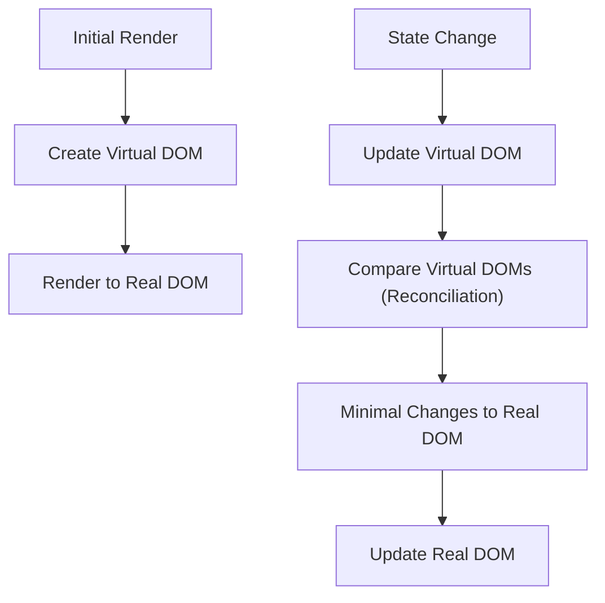
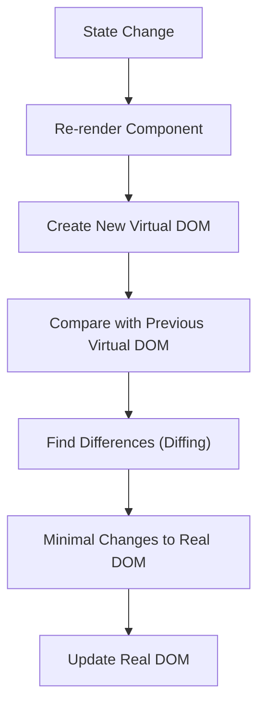

# **Virtual DOM and Reconciliation in React**

React is known for its efficient rendering and high performance when it comes to updating the UI. Two crucial concepts that make React fast are the **Virtual DOM** and **Reconciliation**. Understanding how they work can help you write more optimized React applications.

Let’s break these concepts down, explain how React uses them to optimize performance, and provide relevant examples and diagrams.

---

## **Virtual DOM in React**

### **What is the Virtual DOM?**

The **Virtual DOM (VDOM)** is a lightweight copy of the actual DOM. React uses the Virtual DOM to efficiently update the UI by performing minimal updates to the actual DOM. Instead of making direct changes to the real DOM, React manipulates the Virtual DOM first and then compares it to the real DOM to apply the necessary changes.

### **How it Works:**

1. **Rendering**: When a React component is rendered, React creates a Virtual DOM tree to represent the structure of the UI.
2. **Updates**: When the state or props of a component change, React updates the Virtual DOM first.
3. **Comparison (Reconciliation)**: React then compares the new Virtual DOM with the previous one to detect changes.
4. **Diffing and Patching**: React calculates the minimal set of changes required to update the real DOM to reflect the new state.
5. **Apply Changes**: Finally, React applies only the changes to the real DOM.

### **Why Use the Virtual DOM?**

* **Efficiency**: Direct manipulation of the real DOM can be slow. By using the Virtual DOM, React ensures that only necessary changes are made to the real DOM, improving performance.
* **Declarative UI**: With the Virtual DOM, React abstracts away the complexities of manual DOM manipulation, letting developers focus on building the UI declaratively.

### **Mermaid Diagram: Virtual DOM Flow**



In the diagram above, we can see that the Virtual DOM is created first, followed by an update based on state changes. React compares the previous Virtual DOM with the updated one, finds minimal changes, and applies those changes to the real DOM.

---

## **Reconciliation in React**

### **What is Reconciliation?**

Reconciliation is the process by which React compares the old Virtual DOM with the new one and determines what changes need to be applied to the real DOM. This process is crucial because it allows React to update the UI efficiently, minimizing the number of DOM updates.

### **How Reconciliation Works:**

1. **Component Render**: When a component’s state or props change, React re-renders the component and creates a new Virtual DOM tree.
2. **Diffing Algorithm**: React uses a diffing algorithm to compare the previous Virtual DOM with the new one. It compares the elements in the tree, looks for differences (or "diffs"), and calculates the minimal set of changes that need to be made.
3. **Tree Traversal**: React starts comparing nodes from the root element and proceeds down to the child elements, using heuristics (like key comparisons) to optimize the diffing process.
4. **Patching**: Once the differences are identified, React applies the minimal set of updates to the real DOM.

### **Key Concepts in Reconciliation**

* **Keys in Lists**: In the context of lists, React uses the `key` prop to identify which elements have changed, been added, or removed. The key helps React minimize the number of elements that need to be re-rendered when the list changes.

```tsx
const listItems = items.map(item => (
  <li key={item.id}>{item.name}</li>
));
```

* **Element Diffing**: React compares elements of the same type (e.g., `<div>` with `<div>`) and updates only the attributes (like className) if they differ.
* **Component Diffing**: React will re-render components if the props or state change, but it will try to avoid re-rendering components that haven’t changed.

### **Example of Reconciliation in Action**

Imagine we have the following simple React component:

```tsx
const TodoList = ({ todos }) => {
  return (
    <ul>
      {todos.map(todo => (
        <li key={todo.id}>{todo.text}</li>
      ))}
    </ul>
  );
};
```

* **Initial Render**: React renders the list of `todos` in the Virtual DOM.
* **State Change**: If a new `todo` is added, React re-renders the component with an updated `todos` array.
* **Diffing Process**: React compares the new list of `todos` with the previous list using the `key` prop to identify which items have changed.
* **Minimal Update**: React only updates the added item in the DOM without re-rendering the entire list.

---

## **Optimizing Reconciliation**

### **1. Use Keys for List Items**

Always provide a unique `key` prop for list items to help React efficiently manage and update lists.

### **2. Avoid Changing Keys Unnecessarily**

Changing the `key` prop of elements or components forces React to treat the element as a new one and discard the previous one, causing unnecessary re-renders.

```tsx
// Correct: Using unique and stable keys
<li key={todo.id}>{todo.text}</li>

// Incorrect: Changing key unnecessarily
<li key={Math.random()}>{todo.text}</li>
```

### **3. Use `React.memo` for Functional Components**

To avoid unnecessary re-renders of components, use `React.memo` for functional components that only depend on their props.

```tsx
const TodoItem = React.memo(({ todo }) => {
  return <div>{todo.text}</div>;
});
```

### **4. Use `shouldComponentUpdate` for Class Components**

For class components, you can override the `shouldComponentUpdate` lifecycle method to prevent unnecessary renders.

```tsx
class TodoItem extends React.Component {
  shouldComponentUpdate(nextProps) {
    return nextProps.todo.text !== this.props.todo.text;
  }

  render() {
    return <div>{this.props.todo.text}</div>;
  }
}
```

---

## **Mermaid Diagram: Reconciliation Process**



In the diagram above, you can see the reconciliation flow:

1. **State change** triggers a re-render.
2. A new Virtual DOM is created and compared with the previous one.
3. Differences are found, and minimal changes are applied to the real DOM.

---

## **Conclusion**

### **Summary of Key Points:**

* **Virtual DOM**: React uses the Virtual DOM as an in-memory representation of the actual DOM to efficiently apply updates.
* **Reconciliation**: The process by which React compares the old and new Virtual DOM and applies the minimal set of changes to the real DOM.
* **Optimization**: Use `React.memo`, `shouldComponentUpdate`, and the `key` prop to optimize reconciliation and reduce unnecessary renders.

### **Performance Benefits:**

* React’s use of the Virtual DOM and efficient reconciliation process minimizes the number of updates to the real DOM, improving performance.
* By applying best practices such as using keys, avoiding unnecessary re-renders, and using `React.memo`, you can optimize React applications for faster UI updates.

React’s Virtual DOM and reconciliation algorithms are fundamental to how React achieves high performance. Understanding these concepts can help you write optimized React code that scales well with large applications.
